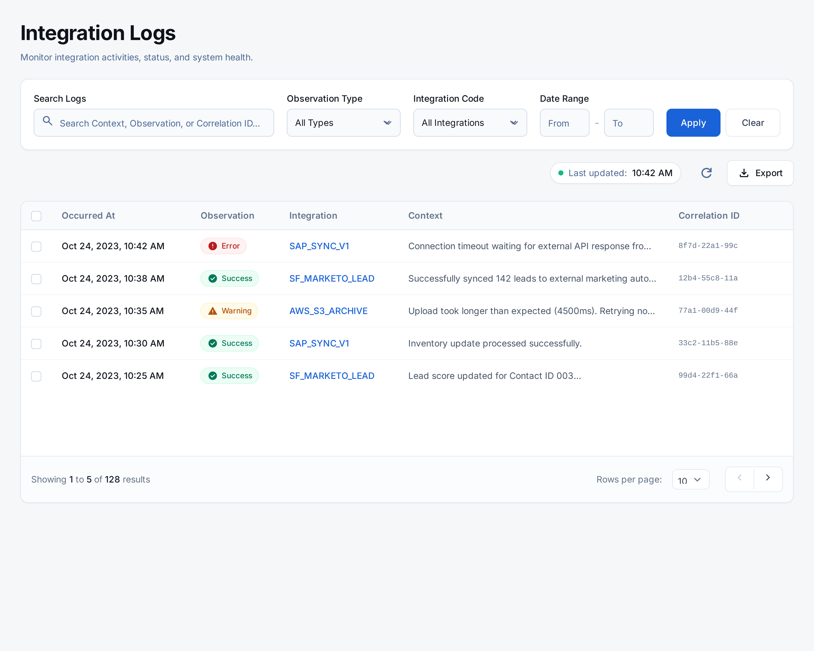

we can do better design.
Based on the ihdFilters component you described in your architecture (UI for filtering logs by state, text, and date range), here are design ideas to improve the filter section, making it robust, user-friendly, and aligned with the Salesforce standard.

Design Ideas for ihdFilters (to be integrated above ihdTable):
Clear Filter Layout (Collapsed by Default):

Concept: To keep the initial view clean, the filters should be collapsible or hidden behind a "Show Filters" button. When expanded, they reveal a well-organized layout.
SLDS Components: Use lightning-card for the filter section. It can have a collapsible body (e.g., using a custom toggle or lightning-accordion if you have distinct filter groups).
Layout: Employ lightning-layout and lightning-layout-item to arrange filter inputs responsively, as shown in your reference image. Each input should have appropriate spacing.
"Last Updated" with Refresh Action:

Concept: Prominently display the last update timestamp with an easy-to-access refresh button, similar to your reference image.
SLDS Components: Use lightning-formatted-date-time for the timestamp and lightning-button-icon for the refresh action.
Placement: Place this at the top-right of the filter card or above the main filter inputs, clearly visible.
Comprehensive Search Bar:

Concept: A single, prominent search bar that allows users to search across multiple relevant fields (Context, Observation, Integration, Correlation) as indicated in your image.
SLDS Components: lightning-input with type="search", an icon-name="utility:search", and a clear placeholder text (e.g., "Search Context, Observation, Integration, Correlation").
Placement: Position this search bar at the very top of your filter section, as it's often the primary filtering method.
Specific Filter Inputs:

Concept: Provide dedicated input fields for specific attributes, allowing precise filtering.
SLDS Components:
Observation Type: lightning-combobox if there's a predefined set of types, or lightning-input if it's free text.
Integration Code: lightning-input or lightning-combobox (if from a list of known integrations).
Correlation Id: lightning-input.
Layout: Arrange these inputs in a grid, perhaps 2 or 3 columns, using lightning-layout to make efficient use of space.
Date and Time Range Pickers:

Concept: Allow users to filter by a specific date and time range for when the log occurred. Your image clearly shows "From" and "To" date/time inputs.
SLDS Components: Use lightning-input type="date" and lightning-input type="time" for both "From" and "To" fields.
Layout: Place these logically together. Using lightning-layout with small-device-size="6" for each pair (Date and Time) can make it responsive.
Action Buttons (Clear, Apply):

Concept: Buttons to apply the filters or clear all filter selections.
SLDS Components: lightning-button with variant="brand" for "Apply Filters" and variant="neutral" for "Clear Filters".
Placement: Place these at the bottom-right of the filter section. "Clear Filters" can also be an icon-button next to the "Search" input for quick resets.
Example HTML Structure for ihdFilters:
<template>
    <lightning-card title="Filter Integration Logs" icon-name="utility:filter">
        

            <!-- Last Updated and Refresh -->
            

                

                    <lightning-icon icon-name="utility:clock" size="x-small" class="slds-m-right_xx-small"></lightning-icon>
                    Last updated: <lightning-formatted-date-time value={lastUpdated} day="2-digit" month="2-digit" year="numeric" hour="2-digit" minute="2-digit"></lightning-formatted-date-time>
                

                <lightning-button-icon icon-name="utility:refresh" alternative-text="Refresh Data" title="Refresh Data" onclick={handleRefresh}></lightning-button-icon>
            

            <!-- Global Search -->
            <lightning-input
                type="search"
                label="Search Logs"
                value={searchValue}
                onchange={handleSearchChange}
                placeholder="Search Context, Observation, Integration, Correlation"
                variant="standard"
                class="slds-var-m-bottom_large"
            >
                Search Logs
            </lightning-input>

            <!-- Specific Filters Grid -->
            <lightning-layout multiple-rows class="slds-var-m-bottom_large">
                <lightning-layout-item size="12" small-device-size="6" medium-device-size="3" class="slds-var-p-horizontal_x-small slds-var-m-bottom_small">
                    <lightning-combobox
                        label="Observation Type"
                        value={observationTypeValue}
                        placeholder="Select Type"
                        options={observationTypeOptions}
                        onchange={handleObservationTypeChange}
                    ></lightning-combobox>
                </lightning-layout-item>

                <lightning-layout-item size="12" small-device-size="6" medium-device-size="3" class="slds-var-p-horizontal_x-small slds-var-m-bottom_small">
                    <lightning-input
                        type="text"
                        label="Integration Code"
                        value={integrationCodeValue}
                        onchange={handleIntegrationCodeChange}
                        placeholder="e.g., BATCH-BILLING"
                    ></lightning-input>
                </lightning-layout-item>

                <lightning-layout-item size="12" small-device-size="6" medium-device-size="3" class="slds-var-p-horizontal_x-small slds-var-m-bottom_small">
                    <lightning-input
                        type="text"
                        label="Correlation Id"
                        value={correlationIdValue}
                        onchange={handleCorrelationIdChange}
                        placeholder="e.g., CORR-3003"
                    ></lightning-input>
                </lightning-layout-item>

                <!-- Date Range Filters -->
                <lightning-layout-item size="12" small-device-size="6" medium-device-size="3" class="slds-var-p-horizontal_x-small slds-var-m-bottom_small">
                    <lightning-input type="date" label="From Date" value={fromDateValue} onchange={handleFromDateChange}></lightning-input>
                </lightning-layout-item>
                <lightning-layout-item size="12" small-device-size="6" medium-device-size="3" class="slds-var-p-horizontal_x-small slds-var-m-bottom_small">
                    <lightning-input type="time" label="From Time" value={fromTimeValue} onchange={handleFromTimeChange}></lightning-input>
                </lightning-layout-item>
                <lightning-layout-item size="12" small-device-size="6" medium-device-size="3" class="slds-var-p-horizontal_x-small slds-var-m-bottom_small">
                    <lightning-input type="date" label="To Date" value={toDateValue} onchange={handleToDateChange}></lightning-input>
                </lightning-layout-item>
                <lightning-layout-item size="12" small-device-size="6" medium-device-size="3" class="slds-var-p-horizontal_x-small slds-var-m-bottom_small">
                    <lightning-input type="time" label="To Time" value={toTimeValue} onchange={handleToTimeChange}></lightning-input>
                </lightning-layout-item>
            </lightning-layout>

            <!-- Filter Action Buttons -->
            

                <lightning-button label="Clear Filters" onclick={handleClearFilters} class="slds-var-m-right_x-small"></lightning-button>
                <lightning-button label="Apply Filters" variant="brand" onclick={handleApplyFilters}></lightning-button>
            

        

    </lightning-card>
</template>
Key Improvements in this Design Concept:

lightning-card: Provides a standard container for the filter section.
lightning-layout & lightning-layout-item: Ensures a responsive and organized grid for filter inputs, adapting to different screen sizes. slds-var-p-horizontal_x-small adds internal spacing between items.
Dedicated Filter Inputs: Clear lightning-input and lightning-combobox components for specific filtering criteria.
Date/Time Pickers: Utilizes lightning-input type="date" and type="time" for intuitive range selection.
"Last Updated" with Refresh: A standard pattern for indicating data freshness and allowing manual updates.
Action Buttons: Clearly defined buttons for Clear Filters and Apply Filters.
SLDS Variable Spacing: Consistent use of slds-var-m-around_*, slds-var-m-bottom_*, slds-var-p-horizontal_* for maintainable and consistent spacing.
Assistive Text: Using  for the search input's label if you prefer the visual input without a visible label, while maintaining accessibility.
This design for ihdFilters will significantly improve the user experience, making it easier to find and analyze specific integration logs.

try to make this design, but keep the existing functionality
