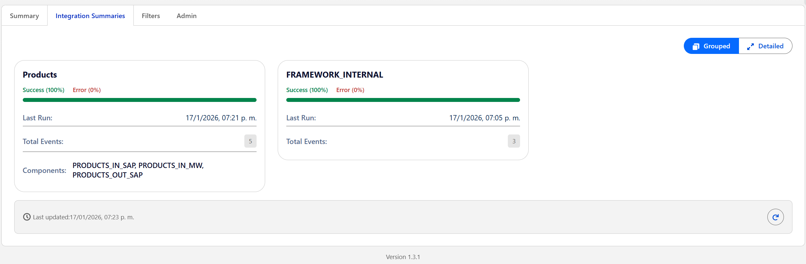

# Integration Health Dashboard (IHD)

The Integration Health Dashboard is an observability framework for Salesforce that decouples event logging from interpretation. It allows developers to emit raw telemetry while enabling administrators to configure severity levels, transport metadata, and monitoring rules dynamically—without code changes.

> [!NOTE]
> **CI/CD & Security:** This project includes enhanced CI/CD with security scanning. See [CI/CD Documentation](docs/CI-CD-IMPLEMENTATION-GUIDE.md) for details.

---

## Dashboard Views

### System Pulse & Summary

The main dashboard provides a real-time overview of all integration health across your org.


_System Pulse showing global success/error rates and quick access to integration summaries._

#### Bulk Event Emission (Best Practices)

The `IntegrationEventPublisher.emit()` method is designed for **summary events**, not for per-record logging in high-volume batches.

> [!WARNING]
> Emitting a Platform Event for every record in a 10,000-record batch will exceed DML limits and platform event hourly allocations.

**Recommended Pattern:**
Accumulate results in memory during your batch/loop execution, and emit a single "Summary" event at the end or in the `finish()` method.

```apex
// Collect errors in a list
List<String> errors = new List<String>();
for (Record r : scope) {
    if (failed) errors.add(r.Id);
}
// Emit once
IntegrationEventPublisher.emit('MY_INT', 'ERROR', null, null, 'Failed records: ' + errors.size());
```

---

### Maintenance: log Retention

The framework includes an automated cleanup solution: `IntegrationLogCleanupBatch`.

By default, it retains logs for **30 days**.

**To schedule daily cleanup (at 2 AM):**

```apex
System.schedule('IHD Log Cleanup Daily', '0 0 2 * * ?', new IntegrationLogCleanupBatch());
```

### Integration Summaries

Switch between **Grouped** and **Detailed** views to analyze integration health at different levels of granularity:

#### Grouped View

Aggregates all integrations by their logical group (e.g., "Products", "Orders") - perfect for high-level monitoring.


_Grouped view consolidates related integrations into single summary cards._

#### Detailed View

Splits each group by **Direction** (Inbound/Outbound) and **Transport** (SAP, MongoDB, etc.) - ideal for pinpointing specific failure points.


_Detailed view expands groups into individual cards like "Products · Inbound · (SAP)" for granular analysis._

### Admin Panel

Administrators can register new integrations and manage existing ones directly from the dashboard.


_Admin Panel showing the Integration Registry with quick actions for registration and configuration._

---

## 📋 System Capabilities

This framework provides a centralized interface for monitoring the health of all integration flows in real-time.

- **Real-Time Monitoring:** Updates instantly using Platform Events and the EMP API.
- **Decoupled Architecture:** Developers log "what happened" (e.g., HTTP 500); Admins define "what it means" (e.g., Error vs. Warning).
- **Transport Metadata:** Tag integrations by data source (e.g., SAP, MongoDB, REST) for better filtering and context.
- **Grouped/Detailed Views:** Toggle between consolidated group view and expanded direction+transport view.
- **Administrative Actions:** Admins can perform operations directly from the dashboard.
- **SLDS 2.0 Compliant:** Fully responsive design utilizing standard SLDS for theme compatibility.

---

## 📦 Installation

### Quick Install

| Version            | Install Link                                                                                         |
| ------------------ | ---------------------------------------------------------------------------------------------------- |
| **Latest (1.3.6)** | [Install Package](https://login.salesforce.com/packaging/installPackage.apexp?p0=04tak000000L6LlAAK) |

### Post-Installation Setup

1. **Assign Permission Sets:**
   - `Integration_Dashboard_Read` → For users who need dashboard access.
   - `Integration_Dashboard_Admin` → For users who need to register integrations and manage logs.
2. **Add Dashboard to App:** Add the `integrationHealthDashboard` LWC component to an App Page or a Lightning Tab.
3. **Configure Evaluation Rules:** Set up Custom Metadata records to define severity mappings.

---

## 🛠 Usage Guide

### For Developers: Emitting Events

Developers interact with the framework via the `IntegrationEventPublisher` class. This abstraction handles the creation of platform events and ensures consistent formatting.

**Example Implementation:**

```apex
// 1. Define the context (Payloads, Headers, Errors)
Map<String, Object> context = new Map<String, Object>{
    'endPoint'   => 'https://api.sap.com/orders',
    'statusCode' => 500,
    'error'      => e.getMessage()
};

// 2. Emit the event
IntegrationEventPublisher.emit(
    'SAP_ORDERS',           // Integration Code (Identifier)
    'HTTP_RESPONSE_200',    // Observation Type (The raw fact)
    'CORR-12345',           // Correlation ID (For traceability)
    null,                   // Parent Event ID (Optional chaining)
    context                 // Context data map
);
```

> **Note:** Do not calculate "Success" or "Failure" status in Apex. Emit the raw observation (e.g., `HTTP_200`, `HTTP_500`) and let the metadata configuration determine the severity.

### For Administrators: Configuration

The power of this framework lies in its metadata-driven engine. Administrators can control how data is displayed and categorized without modifying Apex code.

#### 1. Integration Registry (`idhIntegration_Definition__mdt`)

This is the **unified registry** for all integrations. It controls identity, display, grouping, transport, and the kill switch.

| Field                | Description                                                              |
| -------------------- | ------------------------------------------------------------------------ |
| **Integration Code** | The exact string used by developers in Apex (e.g., `SAP_ORDERS`)         |
| **Label**            | Friendly display name for the dashboard (e.g., "SAP Order Sync")         |
| **Group**            | Logical grouping for charts (e.g., "Accounts", "Leads", "Opportunities") |
| **Direction**        | Inbound / Outbound                                                       |
| **Transport**        | Data source or protocol (e.g., "SAP", "MongoDB", "REST", "Event")        |
| **Enabled**          | ⚡ **Kill Switch** - If unchecked, events are **blocked at emission**    |

> **Kill Switch Behavior:**
>
> - **Registered + Enabled:** ✅ Events are emitted and logged normally.
> - **Registered + Disabled:** 🚫 Events are **blocked at the source** - no event, no log.
> - **Unregistered:** ✅ Events are allowed (developer-friendly for new integrations).

> **Note:** Unregistered integrations may notify admins for fast handling and prevent errors, they should be registered as soon as possible.

#### 2. Severity: Evaluation Rules (`idhIntegration_Evaluation_Rule__mdt`)

This maps raw technical facts to business impact. This allows developers to remain neutral while observers define the "health" status.

| Field                | Description                    | Example    |
| -------------------- | ------------------------------ | ---------- |
| **Observation Type** | The raw string emitted by code | `HTTP_503` |
| **Severity**         | The visual color/status in IHD | `ERROR`    |

**Severity Levels:**

- 🟢 **Success:** Operation completed as expected.
- 🔵 **Info:** Technical event for tracing, no action needed.
- 🟡 **Warning:** Operation completed with non-critical issues.
- 🔴 **Error / Fatal:** Operation failed; requires immediate attention.
- ❓ **Unclassified:** Logs without a matching rule display a question mark icon.

---

### 💡 Example Flow

| Step                     | Data Source    | Value                                                                 |
| ------------------------ | -------------- | --------------------------------------------------------------------- |
| **1. Apex Emit**         | Developer Code | `IntegrationEventPublisher.emit('SF_TO_SAP_ORDERS', 'HTTP_404', ...)` |
| **2. Kill Switch Check** | Registry MDT   | Is `SF_TO_SAP_ORDERS` Enabled? → **Yes** → Proceed                    |
| **3. Interpret**         | Evaluation MDT | Found `HTTP_404` → Severity set to **WARNING**                        |
| **4. Display**           | Registry MDT   | Label: "SAP Order Sync", Group: "ERP Systems", Transport: "SAP"       |

---

## 🏗 Architecture Overview

The system operates on a four-stage data model:

1. **Transport (`IntegrationEvent__e`):** A Platform Event that acts as the real-time signal carrier.
2. **Storage (`Integration_Log__c`):** Persistent storage for historical analysis and audit trails.
3. **Registry (`idhIntegration_Definition__mdt`):** Unified registry for integrations with labels, groups, transport, and kill switch.
4. **Interpretation (`idhIntegration_Evaluation_Rule__mdt`):** Maps raw technical signals to business-level severity.

> For detailed architectural documentation, see the [docs/](docs/) directory.

---

## 📁 Package Contents

### Apex Classes

| Class                         | Description                                          |
| ----------------------------- | ---------------------------------------------------- |
| `IntegrationEventPublisher`   | Public API for emitting integration events           |
| `IntegrationHealthController` | LWC controller for dashboard queries                 |
| `IntegrationHealthService`    | Business logic layer for dashboard operations        |
| `IntegrationHealthSelector`   | Data access layer for logs and metadata              |
| `IntegrationRegistryService`  | Handles metadata deployment for integration registry |
| `IntegrationLogHandler`       | Trigger handler for event processing                 |
| `IntegrationContextService`   | Context normalization service                        |

### LWC Components

| Component                    | Description                              |
| ---------------------------- | ---------------------------------------- |
| `integrationHealthDashboard` | Main dashboard container                 |
| `ihdFilters`                 | Filter controls (date, search, type)     |
| `ihdTable`                   | Log records data table                   |
| `ihdDetailDrawer`            | Log detail modal (view-only)             |
| `ihdStatsCard`               | Statistics display cards                 |
| `ihdIntegrationSummaryCard`  | Integration summary tiles                |
| `ihdAdminPanel`              | Admin panel for registry management      |
| `timeClockPicker`            | Time selection component                 |
| `utilsLogsApi`               | Shared utility library for API and state |

### Custom Objects

| Object                | Description                            |
| --------------------- | -------------------------------------- |
| `Integration_Log__c`  | Persistent log storage                 |
| `IntegrationEvent__e` | Platform Event for real-time transport |

### Custom Metadata Types

| Type                                  | Description                                                |
| ------------------------------------- | ---------------------------------------------------------- |
| `idhIntegration_Definition__mdt`      | Integration Registry (identity, labels, groups, transport) |
| `idhIntegration_Evaluation_Rule__mdt` | Severity mapping rules                                     |

---

## 🔧 Technical Details

| Property         | Value                   |
| ---------------- | ----------------------- |
| **API Version**  | 65.0                    |
| **Namespace**    | None (Unlocked Package) |
| **Package Type** | Unlocked Package (2GP)  |

---

## 🔒 CI/CD & Security

This project implements enterprise-grade CI/CD with comprehensive security scanning:

### Automated Quality Gates

- ✅ **Security Scanning**: PMD analysis for Apex vulnerabilities (SOQL injection, XSS, CSRF)
- ✅ **Code Quality**: ESLint, Prettier, and LWC unit tests
- ✅ **Package Validation**: Automated scratch org testing with 85% coverage requirement
- ✅ **Dependency Scanning**: NPM audit for known vulnerabilities

### CI/CD Workflows

| Workflow | Trigger | Purpose |
|----------|---------|---------|
| **CI Enhanced** | Pull Requests | Security scan + quality checks + package validation |
| **CI Standard** | Pull Requests | Original workflow (still functional) |
| **Release** | Push to main | Package promotion + GitHub release |

### Security Philosophy

Our PMD configuration is **developer-friendly**:
- Only **critical security issues** fail builds (SOQL injection, XSS, CSRF)
- Code style and documentation are **informational only**
- **No unnecessary blockers** - focus on real vulnerabilities

### Documentation

- 📊 [Complete Security Analysis](docs/CI-CD-SECURITY-ANALYSIS.md)
- 📘 [Implementation Guide](docs/CI-CD-IMPLEMENTATION-GUIDE.md)
- 🔧 [Original CI/CD Docs](docs/CI/CD.md)
- ⚙️ [Setup Guide](.github/SETUP.md)

---

## 📄 License

This project is provided as-is for use in Salesforce orgs.
