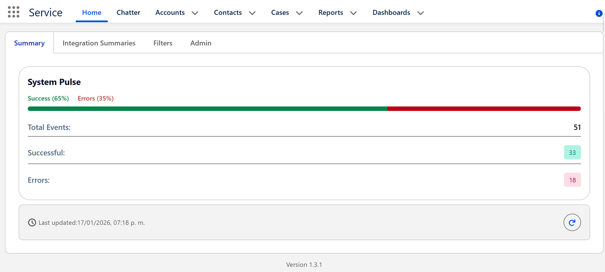
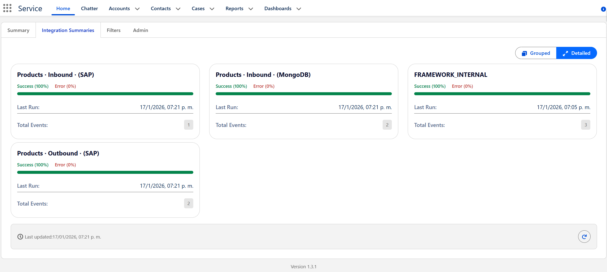
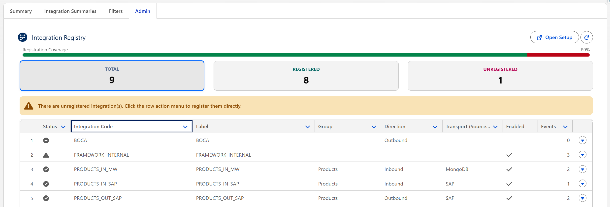

# Integration Events Framework (IEF)

  

**The enterprise-grade observability framework for Salesforce.** Decouple your Apex logging from business interpretation, enable real-time monitoring, and empower admins to manage integration health without a single line of code.

---

## 🚀 Why IED?

Traditional Salesforce logging is brittle. Developers hardcode "Errors", Logs get buried in Custom Objects, and nobody knows if an integration is actually _healthy_ until a customer complains.

**IED flips the script:**

- ** decouple Signal from Noise:** Developers emit raw _observations_ (e.g., the code response from a REST request), not judgments.
- **Metadata-Driven Intelligence:** Admins define severity. Is a 404 an Error? A Warning? Or just Info? You decide, in production, instantly.
- **Real-Time "Pulse":** Watch your integrations breathe. Live updates via Platform Events (EMP API).
- **Zero-Code Kill Switches:** Stop a runaway integration from spamming the logs instantly from the dashboard.

---

## 📊 Visual Observability

### System Pulse

The heartbeat of your ecosystem. See global health, failure rates, and active streams in real-time.



### Granular & Grouped Views

Drill down from high-level Groups (e.g., "ERP Systems") to specific Transport methods (e.g., "SAP · Outbound").



---

## 💻 Developer Experience

Forget complex logging frameworks. You have **one method** to learn.

```apex
// 1. Emit the raw fact. Don't judge it.
IntegrationEventPublisher.emit(
    'SAP_ORDER_SYNC',      // Integration Code (Identity)
    'HTTP_503',            // Observation (Fact)
    'CORR-ID-998877',      // Correlation ID (Traceability)
    null,                  // Parent ID (Optional)
    new Map<String, Object>{ 'endpoint' => 'api.sap.com', 'retry' => 3 } // Context
);
```

**That's it.** The framework handles the rest:

- Asynchronous formatting
- Platform Event publishing
- Deduplication & buffering (if configured)

---

## 🛡 Admin Empowerment

Admins are no longer helpless spectators. Use the **Admin Panel** to manage registry and rules directly.

### 1. The Kill Switch ⚡

Bad code implementing an infinite loop? External API down and spamming errors?
**Disable the integration instantly** from the UI. The framework blocks events _at the source_, saving your limits.

### 2. Semantic Mapping

Map technical signals to business reality using Custom Metadata:

- `HTTP_200` → ✅ **Success**
- `HTTP_203` → 🟡 **Warning**
- `HTTP_500` → 🔴 **Error**



---

## 📦 Installation

We publish a new Unlocked Package version for every release. You can find the installation link for the latest version on GitHub.

👉 **[Get the Latest Release](https://github.com/Santiago01011/integration-events-framework/releases/latest)**

### Post-Install Checklist

1.  **Assign Permission Sets**:
    - `Integration_Dashboard_Admin` (For configuring rules)
    - `Integration_Dashboard_Read` (For viewing logs)
2.  **Add to UI**: Drag the `integrationHealthDashboard` LWC onto any App Page or create a LWC tab.
3.  **Schedule Cleanup**: Keep your storage lean.
    ```apex
    // Execute in Developer Console
    System.schedule('IED Daily Cleanup', '0 0 2 * * ?', new IntegrationLogCleanupBatch());
    ```

---

## 🔗 Resources

- **[Best Practices](docs/BEST_PRACTICES.md)** - Bulkification, event loops, and limit management.
- **[Troubleshooting](docs/TROUBLESHOOTING.md)** - Common issues and solutions.

---

## 📄 License

This project is provided as-is for use in Salesforce orgs.
