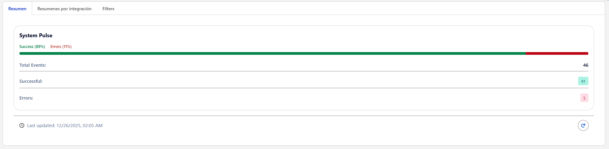
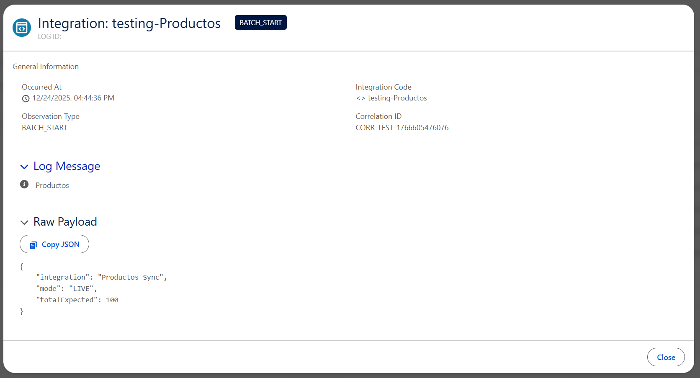

# Integration Health Dashboard (IHD)

The Integration Health Dashboard is an observability framework for Salesforce that decouples event logging from interpretation. It allows developers to emit raw telemetry while enabling administrators to configure severity levels and monitoring rules dynamically, without code changes.


*(System Pulse and Integration Summaries)*

---

## 📋 System Capabilities

This framework provides a centralized interface for monitoring the health of all integration flows in real-time.

* **Real-Time Monitoring:** Updates instantly using Platform Events and the EMP API.
* **Decoupled Architecture:** Developers log "what happened" (e.g., HTTP 500); Admins define "what it means" (e.g., Error vs. Warning).
* **Developer Tools:** Includes a specialized Detail Drawer with a one-click copy functionality.
* **SLDS 2.0 Compliant:** Fully responsive design utilizing standard Salesforce Design Tokens for theme compatibility.

---

## 🛠 Usage Guide

### For Developers: Emitting Events
Developers interact with the framework via the `IntegrationEventPublisher` class. This abstraction handles the creation of platform events and ensures consistent formatting.

**Example Implementation:**
```apex
// 1. Define the context (Payloads, Headers, Errors)
Map<String, Object> context = new Map<String, Object>{
    'endPoint'   => '[https://api.sap.com/orders](https://api.sap.com/orders)',
    'statusCode' => 500,
    'error'      => e.getMessage()
};

// 2. Emit the event
IntegrationEventPublisher.emit(
    'SAP_ORDERS',           // Integration Code (Identifier)
    'HTTP_RESPONSE',        // Observation Type (The raw fact)
    'CORR-12345',           // Correlation ID (For traceability)
    null,                   // Parent Event ID (Optional chaining)
    context                 // Context data map
);

```

> **Note:** Do not calculate "Success" or "Failure" status in Apex. Emit the raw observation (e.g., `HTTP_200`, `HTTP_500`) and let the metadata configuration determine the severity.

---

### For Administrators: Configuration

System behavior and severity levels are managed via Custom Metadata Types, allowing for operational adjustments without deployment.

#### 1. Registering Integrations

To enable monitoring for a new flow:

1. Navigate to **Setup > Custom Metadata Types**.
2. Manage records for **Integration Definition**.
3. Create a record with the **Integration Code** provided by the developer (e.g., `SAP_ORDERS`).

#### 2. Configuring Severity Rules

To define how specific events are interpreted in the dashboard:

1. Navigate to **Setup > Custom Metadata Types**.
2. Manage records for **Integration Evaluation Rule**.
3. Map an **Observation Type** (e.g., `HTTP_503`) to a **Severity Level**:
* **Success:** Green indicators.
* **Info:** Blue/Neutral indicators.
* **Warning:** Yellow indicators.
* **Error:** Red indicators.


---

## 🏗 Architecture Overview

The system operates on a four-stage data model:

1. **Transport (`IntegrationEvent__e`):** A Platform Event that acts as the real-time signal carrier.
2. **Storage (`Integration_Log__c`):** Persistent storage for historical analysis and audit trails.
3. **Registry (`Integration_Definition__mdt`):** Defines known integrations and their active status.
4. **Interpretation (`Integration_Evaluation_Rule__mdt`):** Maps raw technical signals to business-level severity.



---
## 📦 Installation

### 1.  **Install Package:**

[Install Integration Health Dashboard v1.1.0](https://login.salesforce.com/packaging/installPackage.apexp?p0=04tak000000I5UHAA0)

### 2. Permissions
Assign the `Integration_Dashboard_User` permission set to relevant users who require access to the dashboard and logs.

### 3. Initial Setup
Ensure base Evaluation Rules (e.g., generic Success/Error mappings) are loaded into Custom Metadata to establish baseline monitoring colors.

**UI-Version:** 1.1.1.12
