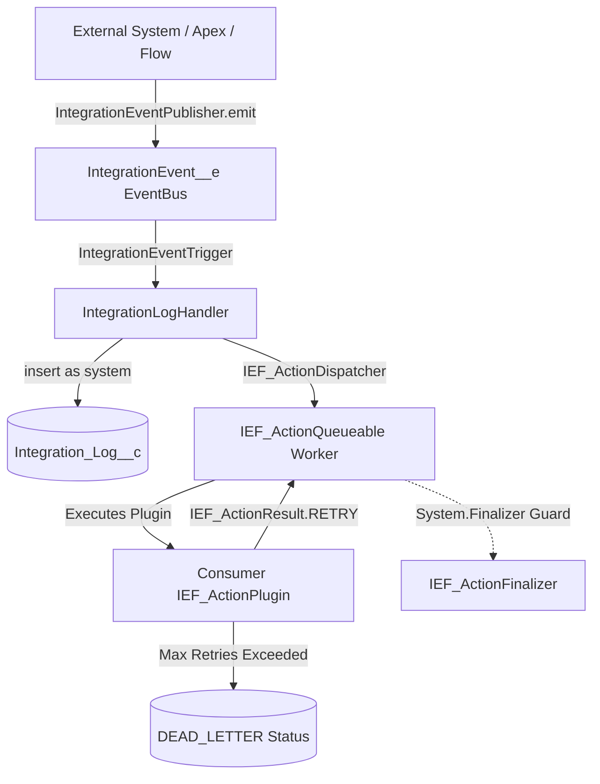

# Action Plugins & Event Resilience Guide

This guide explains how external teams and subscriber orgs consume the **Integration Events Framework (IEF)** to ingest events, build custom business automations, and leverage automated retry and dead-letter resilience.

---

## 1. Architectural Model

IEF separates **Infrastructure & Guarantees** from **Domain Logic & Policies**:



- **Core Infrastructure (IEF)**: Bulk ingestion, Platform Event replay checkpoints, Queueable dispatcher, `System.Finalizer` governor safety, and retry state persistence.
- **Consumer Plugins (Your App)**: Business API callouts, ERP syncs, Slack notifications, and custom retry decision policies.

---

## 2. Emitting Events (Ingestion)

### Single Event

```apex
IntegrationEventPublisher.emit(
    'SAP_ORDERS',
    'ORDER_CREATED',
    'CORR-9921',
    null,
    JSON.serialize(new Map<String, Object>{ 'orderId' => 'ORD-12345', 'amount' => 500.00 })
);
```

### Bulk Ingestion (Zero-DML Waste)

```apex
List<IEF_EventRequest> requests = new List<IEF_EventRequest>();
for (Order ord : orders) {
    requests.add(new IEF_EventRequest(
        'SAP_ORDERS',
        'ORDER_CREATED',
        ord.OrderNumber,
        null,
        JSON.serialize(ord)
    ));
}
IntegrationEventPublisher.emit(requests);
```

---

## 3. Creating an Action Plugin

To act upon incoming integration events asynchronously, implement the `IEF_ActionPlugin` interface:

```apex
/**
 * @description Example Action Plugin: Dispatches order payload to SAP ERP endpoint.
 */
public with sharing class SAP_OrderSyncActionPlugin implements IEF_ActionPlugin {
  public IEF_ActionResult execute(IEF_ActionContext ctx) {
    // 1. Inspect incoming context and payload
    String payload = ctx.payloadContext;
    Integer currentAttempt = ctx.retryCount;

    // 2. Perform HTTP Callout (Queueable automatically allows callouts)
    HttpRequest req = new HttpRequest();
    req.setEndpoint('callout:SAP_ERP/orders');
    req.setMethod('POST');
    req.setBody(payload);

    Http http = new Http();
    HttpResponse res;
    try {
      res = http.send(req);
    } catch (Exception ex) {
      // Transient network failure -> signal Core to retry
      return IEF_ActionResult.retry(
        'Network error connecting to SAP: ' + ex.getMessage()
      );
    }

    // 3. Evaluate HTTP response
    if (res.getStatusCode() == 200 || res.getStatusCode() == 201) {
      return IEF_ActionResult.success('SAP Order created successfully.');
    } else if (res.getStatusCode() == 429 || res.getStatusCode() >= 500) {
      // Server busy or 5xx -> retry
      return IEF_ActionResult.retry(
        'SAP returned HTTP ' + res.getStatusCode() + ': ' + res.getBody()
      );
    } else {
      // 4xx client errors (bad payload) -> Fatal failure (no retry)
      return IEF_ActionResult.fatalFailure(
        'Invalid order payload: HTTP ' + res.getStatusCode()
      );
    }
  }
}
```

---

## 4. Registering the Action Plugin in Custom Metadata

Create a record in `IEF_Plugin__mdt`:

| Field                     | Value                       | Notes                                          |
| :------------------------ | :-------------------------- | :--------------------------------------------- |
| **DeveloperName**         | `SAP_OrderSyncAction`       | Unique developer identifier                    |
| **Label**                 | `SAP Order Sync Action`     | User-friendly label                            |
| **ApexClassName\_\_c**    | `SAP_OrderSyncActionPlugin` | Name of your Apex class                        |
| **PluginType\_\_c**       | `ACTION`                    | Declares this as an asynchronous Action plugin |
| **SObjectType\_\_c**      | `Integration_Log__c`        | Target SObject (or blank for global)           |
| **Enabled\_\_c**          | `true`                      | Enables execution                              |
| **Contract_Version\_\_c** | `1.0`                       | Target major contract version                  |

---

## 5. Built-in Resilience & Dead-Letter Safety

1. **`System.Finalizer` Protection**:
   - If an unhandled exception or uncatchable governor limit (e.g. `Apex CPU time limit exceeded`) crashes the Queueable, `IEF_ActionFinalizer` catches it, records the error stack on `Integration_Log__c.ErrorMessage__c`, and safely transitions the log.
2. **Retry Tracking**:
   - When a plugin returns `IEF_ActionResult.retry(...)`, Core increments `RetryCount__c` and sets `Status__c = 'PENDING'`.
   - When `RetryCount__c >= MaxRetries__c` (default 3), Core automatically transitions the record to `Status__c = 'DEAD_LETTER'`.
3. **Dead-Letter Monitoring**:
   - Dead-letter records can be monitored via the IEF Dashboard or queried directly:
   ```soql
   SELECT Id, IntegrationCode__c, CorrelationId__c, RetryCount__c, ErrorMessage__c
   FROM Integration_Log__c
   WHERE Status__c = 'DEAD_LETTER'
   ORDER BY CreatedDate DESC
   ```
