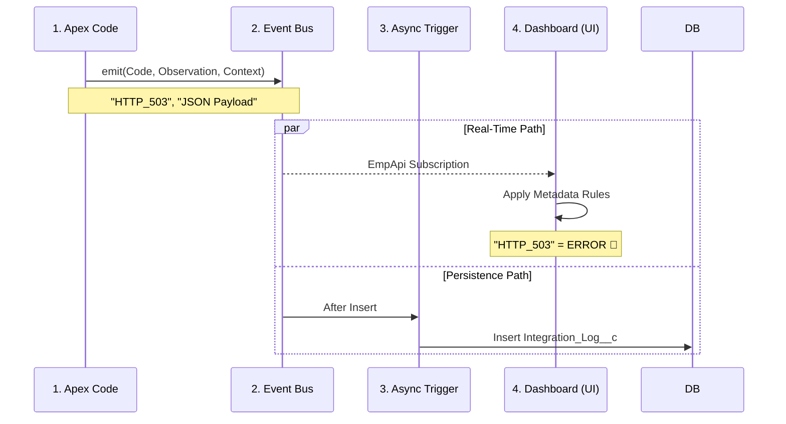

# Architecture: The IED Pattern

The **Integration Events Dashboard (IED)** is built on a specific architectural pattern: **Decoupled Telemetry**.

Instead of your code knowing _what_ an error is, it simply reports _what happened_. The interpretation of that event happens asynchronously, driven by metadata.

## 🏗 High-Level Data Flow

The system operates in a 4-stage pipeline, moving data from code to dashboard in real-time.

---

## 🧩 The 4 Core Layers

### 1. The Nervous System (Transport)

**Component:** `IntegrationEvent__e` (Platform Event)

Use this as your high-speed signal carrier.

- **Why Platform Events?** They are decoupled from the database transaction. If your main transaction rolls back, you often _still_ want the log (e.g., "Attempted to save account but failed").
- **Buffer:** Acts as a shock absorber during high-volume spikes.

### 2. The Brain (Interpretation)

**Component:** `Custom Metadata Types` (`idhIntegration_Evaluation_Rule__mdt`)

This is where "Business Logic" lives for monitoring.

- **Raw Signal:** `HTTP_404`
- **Interpretation:** "Warning" (Severity 3)
- **Benefit:** Change severities in production without deploying code.

### 3. The Memory (Persistence)

**Component:** `Integration_Log__c` (Big Object / Custom Object)

Long-term storage for audit trails and deep debugging.

- **Async Insertion:** The `IntegrationLogHandler` runs asynchronously, meaning logging never slows down your synchronous user transaction.
- **Context Normalization:** Large JSON payloads are automatically trimmed and formatted for query performance.

### 4. The Face (Visualization)

**Component:** `iefDashboard` (LWC)

The UI subscribes directly to the **Platform Event**, not the database.

- **Effect:** The dashboard updates _instantly_ when an event occurs, often before the record is even saved to the database.
- **State:** Maintain its own ephemeral state for the "Live Pulse" view.

---

## ⚡ Performance & Scalability

### The "Kill Switch" Mechanism

Before an event is even constructed, the `IntegrationEventPublisher` checks the **Registry** (`idhIntegration_Definition__mdt`).

- **If Enabled:** ✅ Event is built and published.
- **If Disabled:** 🛑 Execution stops immediately. Zero heap usage. Zero DML.

This allows you to silence a runaway integration (e.g., an infinite loop error) instantly from production without a deployment.

### Event Aggregation (Bulkification)

For high-volume batch jobs, the framework encourages the **Summary Pattern**:

1.  Batch runs process 2,000 records.
2.  Errors are collected in a `List<String>`.
3.  **One** summary event is emitted at the end of the batch `execute()` method.

---

## 🔐 Security Architecture

### Emission (Write)

- **Context:** `Without Sharing`.
- **Why?** If a Guest User or Community User encounters an error, you absolutely want that log. The persistence layer runs as `System` to guarantee the log is captured regardless of the user's permissions.

### Visualization (Read)

- **Context:** `System Mode` (with FLS checks).
- **Why?** The Dashboard usually needs to show logs created by _automation_ (System), which the viewing user might not normally see.
- **Gatekeeper:** Access is strictly controlled via the `Integration_Dashboard_Read` Permission Set.

---

## 📂 Key Artifacts

| Layer       | File/Component                  | Purpose                                           |
| :---------- | :------------------------------ | :------------------------------------------------ |
| **API**     | `IntegrationEventPublisher.cls` | The strict global API for emitting events.        |
| **Trigger** | `IntegrationLogHandler.cls`     | Async trigger that hydrates `Integration_Log__c`. |
| **UI**      | `iefDashboard`                  | The container LWC for the entire app.             |
| **Utils**   | `utilsLogsApi.js`               | Shared JS library for EMP API and toast pulse.    |
