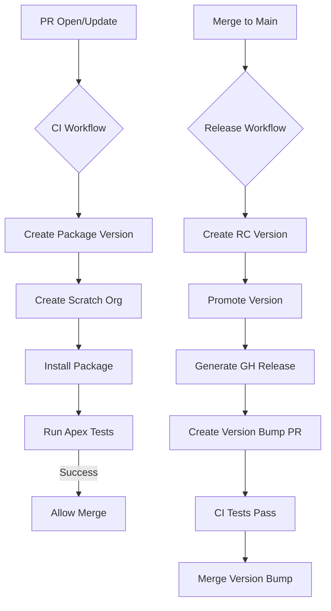

# CI/CD & Infrastructure for Integration Events Framework

This document details the automated pipeline implemented in 2026 to handle the compilation, testing, and release of the `IntegrationLogsFrameworkv2` package.

---

## 1. DevOps Architecture

Our pipeline follows a **Package-First** development model, where every code change is validated by creating a beta package version and testing it in a clean environment.



---

## 2. GitHub Actions Workflows

We use the official `salesforce/cli:latest-full` container for high-performance execution.

### CI Workflow (`ci.yml`)

- **Trigger**: Pull Requests affecting `force-app/**`.
- **Logic**:
  1. Authenticates to DevHub via JWT.
  2. Creates a temporary Beta package version.
  3. Provisions a Scratch Org.
  4. Installs the new version to ensure zero-dependency installation.
  5. Runs all Apex tests with code coverage requirements.

### Release Workflow (`release.yml`)

- **Trigger**: Direct pushes (merges) to `main`.
- **Logic**:
  1. Builds a fresh version candidate.
  2. Runs `sf package version promote` to mark it as Production-ready.
  3. Creates a GitHub Release with the installation link.
  4. Automatically creates a Pull Request with the version bump to `sfdx-project.json`.
     - The PR is created to respect branch protection rules.
     - Once CI passes, the PR can be merged to update the version number.

> **Note**: The version bump is done via PR to comply with branch protection rules requiring all changes to go through pull requests and pass required status checks.

---

## 3. Authentication (JWT Flow)

CI environments use the **JSON Web Token (JWT)** flow for headless authentication.

- **Private Key**: Stored in GitHub Secret `DEVHUB_SERVER_KEY`.
- **Consumer Key**: Stored in GitHub Secret `DEVHUB_CONSUMER_KEY`.
- **Grant Command**:
  ```bash
  sf org login jwt --client-id $KEY --jwt-key-file server.key --username $USER
  ```

---

## 4. Configuration

### Scratch Org Definition (`config/project-scratch-def.json`)

Enabled features for this framework:

- **PlatformEvents**: Required for the async logging architecture.
- **EventLogWaveIntegration**: For future analytics integration.

### Package Versioning (`sfdx-project.json`)

The project uses the `NEXT` keyword to automate semantic versioning:

- Current: `1.3.6.NEXT`
- The system automatically increments the build number (e.g., `1.3.6.1`, `1.3.6.2`).

---

## 5. Local Development Helpers

Check the `scripts/` directory for automation tools:

- `setup-jwt.ps1`: Instructions for rotating certificates.
- `local-package-version.ps1`: Create a package version locally for manual testing.
