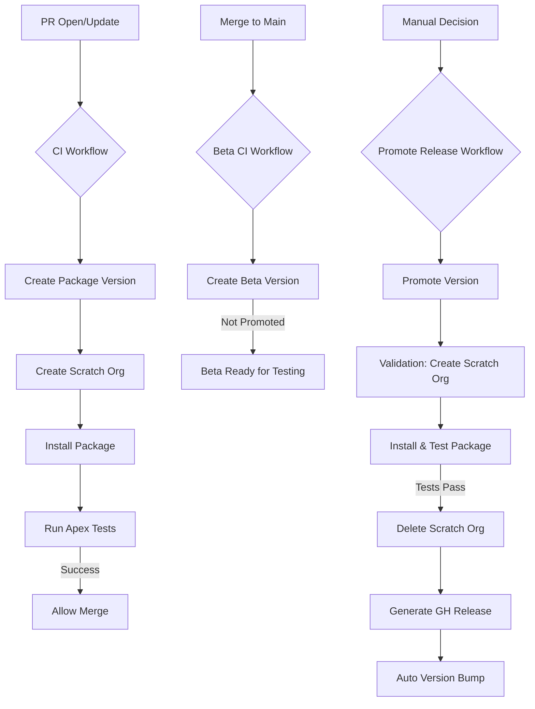

# CI/CD & Infrastructure for Integration Events Framework

This document details the automated pipeline implemented in 2026 to handle the compilation, testing, and release of the `IntegrationLogsFrameworkv2` package.

---

## 1. DevOps Architecture

Our pipeline follows a **Package-First** development model, where every code change is validated by creating a beta package version and testing it in a clean environment.



---

## 2. GitHub Actions Workflows

We use the official `salesforce/cli:latest-full` container for high-performance execution.

### CI Workflow (`ci.yml`)

- **Trigger**: Pull Requests affecting `force-app/**`.
- **Logic**:
  1. Authenticates to DevHub via JWT.
  2. Creates a temporary Beta package version.
  3. Provisions a Scratch Org.
  4. Installs the new version to ensure zero-dependency installation.
  5. Runs all Apex tests with code coverage requirements.

### Beta CI Workflow (`beta-ci.yml`)

- **Trigger**: Pushes (merges) to `main` affecting `force-app/**` or `sfdx-project.json`.
- **Logic**:
  1. Builds a beta package version (**NOT promoted**).
  2. Runs code coverage validation.
  3. Posts summary with installation instructions for testing.
- **Purpose**: Creates unlimited beta versions for testing without burning released version budget.

### Promote Release Workflow (`promote-release.yml`)

- **Trigger**: **Manual workflow dispatch only**.
- **Inputs**: Package Version ID (04t...) from a beta build.
- **Logic**:
  1. Validates the version ID.
  2. Runs `sf package version promote` to mark it as Production-ready.
  3. **Post-promotion validation** (production-grade safety):
     - Creates a fresh scratch org
     - Installs the promoted package
     - Runs all Apex tests
     - Deletes the scratch org
  4. Creates a GitHub Release with the installation link (only if validation passes).
  5. Auto-bumps the version number in `sfdx-project.json`.
- **Purpose**: Controlled release process that preserves the 1000 released version limit.
- **Safety**: Package is validated in a clean environment before the GitHub release is created.

> **⚠️ Important**: The old auto-promote workflow is backed up as `release.yml.old-auto-promote-backup`

---

## 4. Package Version Management Strategy

### ⚠️ Salesforce Version Limits

- **Released (promoted) versions**: Hard limit of 1000 per package (cannot be deleted)
- **Beta versions**: Unlimited

### Workflow Split

**Beta CI** (`beta-ci.yml`) - Automatic

- Runs on every merge to main
- Creates beta versions (NOT promoted)
- Zero cost against version limit

**Promote** (`promote-release.yml`) - Manual only

- Triggered manually via Actions UI
- Promotes chosen beta to production
- Validates in fresh scratch org before creating GitHub release
- Auto-bumps version in sfdx-project.json

### Why This Matters

Old workflow auto-promoted every merge → would hit 1000 limit in 3-8 years.
New workflow only promotes on demand → 40+ years runway.

> **Backup**: Old workflow saved as `release.yml.old-auto-promote-backup`

---

## 5. Authentication (JWT Flow)

CI environments use the **JSON Web Token (JWT)** flow for headless authentication.

- **Private Key**: Stored in GitHub Secret `DEVHUB_SERVER_KEY`.
- **Consumer Key**: Stored in GitHub Secret `DEVHUB_CONSUMER_KEY`.
- **Grant Command**:
  ```bash
  sf org login jwt --client-id $KEY --jwt-key-file server.key --username $USER
  ```

---

## 6. Configuration

### Scratch Org Definition (`config/project-scratch-def.json`)

Enabled features for this framework:

- **PlatformEvents**: Required for the async logging architecture.
- **EventLogWaveIntegration**: For future analytics integration.

### Package Versioning (`sfdx-project.json`)

The project uses the `NEXT` keyword to automate semantic versioning:

- Current: `1.3.6.NEXT`
- The system automatically increments the build number (e.g., `1.3.6.1`, `1.3.6.2`).

---

## 7. Local Development Helpers

Check the `scripts/` directory for automation tools:

- `setup-jwt.ps1`: Instructions for rotating certificates.
- `local-package-version.ps1`: Create a package version locally for manual testing.
