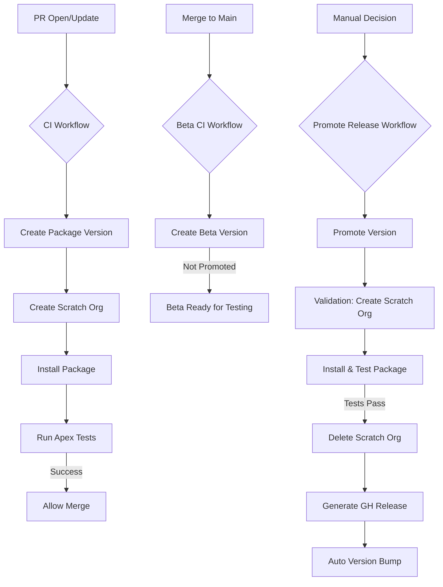

# Package-Driven Development Workflow

## 1. Goal of this Document

This document proposes a **Package-Driven Development workflow** as an _optional but recommended_ alternative for specific tickets and components.

The objective is **not** to replace existing delivery mechanisms, but to:

- Reduce regression risk.
- Improve traceability.
- Establish clear ownership for critical components.
- Enable safer parallel development.

## 2. Scope: When this Process Applies

### This process applies when:

- The ticket affects **shared or reusable components**.
- The component is expected to evolve over time.
- The change has medium/high regression risk.
- The feature or fix can be logically grouped.

### This process does NOT apply when:

- One-off org configuration.
- Emergency prod-only hotfixes (see §7).
- Truly local / disposable customizations.

## 3. Core Principle

**If a component is part of a package, all changes to it must go through that package’s repository and release process.**

Orgs (Sandboxes, UAT, Prod) are **consumers** of the package, not authorities on its code.

## 4. Roles & Ownership

### Package Owner

- Owns the package repository.
- Reviews Pull Requests (PRs).
- Decides when to cut a release.

### Contributor (Any Developer)

- Implements changes via PR.
- Does not modify packaged components directly in orgs.

### CI System

- Enforces installability.
- Validates tests.
- Acts as the “gatekeeper” for quality.

## 5. Proposed Workflow

### High-Level Flow

1.  Ticket identified as a "Package Candidate".
2.  Change implemented in the package repository.
3.  CI validates installability and tests.
4.  Beta package version created.
5.  Optional testing in sandbox using the beta version.
6.  Manual promotion to released version.
7.  Installation in target org(s).

### Reference Implementation

## 6. CI/CD: Required vs. Optional

The current `IntegrationLogsFrameworkv2` pipeline is a **fully realized example**, but teams can adopt this incrementally.

### Required (Minimum)

- **Git Repository**: A dedicated repository for the package source.
- **One Pipeline**: A simple pipeline that:
  - Creates a package version.
  - Installs it in a clean org (validation).
  - Runs tests.

### Optional (But Recommended)

- Scratch org validation.
- Beta vs. Promoted split (to save version limits).
- Auto version bumping.
- GitHub Releases for changelogs.

## 7. Hotfix & Exception Handling

### Emergency Hotfix Policy

Org-direct hotfixes are allowed **only if**:

1.  The change is documented in the ticket.
2.  The same change is replicated in the package repo immediately.
3.  A patch package version is created ASAP to "catch up" the package.

**Terminology:**

- Org hotfixes are **temporary patches**.
- Packages are the **source of truth**.

## 8. Avoiding the Monolithic Package Problem

A common concern is that packages will become too large to manage.

- **Bounded Contexts**: Packages should represent bounded contexts (e.g., "Payment Processing", "Logging Framework"), not teams or entire orgs.
- **Modularity**: Multiple small packages are preferred over one large one.
- **Ownership Limit**: If a package grows uncontrollably, it is a signal that architectural boundaries need review—not a failure of the packaging model.

## 9. Why this is Safer than Org-Based Development

- **Installability Guarantee**: Every release is proven to be installable from scratch.
- **No Overwrites**: Dependencies are explicit; no silent overwrites of metadata.
- **History**: Full change history is Git-based.
- **Reproducibility**: Environments can be reproduced reliably.
- **Rollback**: Easier rollback by simply installing the previous version.

## 10. Reference Implementation: Integration Events Framework

The `IntegrationLogsFrameworkv2` project serves as a production-grade reference implementation of this workflow.

It demonstrates:

- Automated Beta creation on merge.
- Strict "Promote" workflow for releases.
- Clean scratch-org validation for every PR.

## 11. Proposed Adoption Strategy

1.  **Pilot**: Select 1–2 upcoming tickets suited for packaging.
2.  **Lean CI**: Use existing CI templates where possible (copy-paste from reference).
3.  **Evaluate**: Assess impact after the first release.
4.  **Expand**: Decide if the model should be applied to other components.
