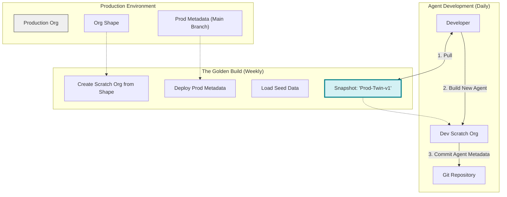
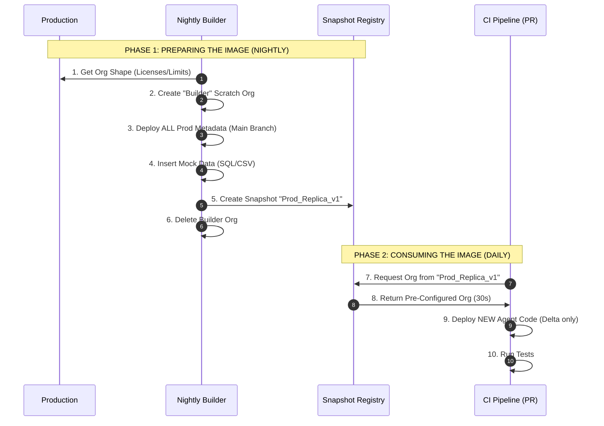

# CI/CD Pipeline: Developing "Agent-First" with Production Parity

> **The Problem:** Scratch orgs are empty. Production is complex. Agents developed in empty orgs "hallucinate" because they lack the historical data and metadata context (Custom Objects, Flows, Validation Rules) present in Production.
>
> **The Solution:** We implement a **"Production Twin" Strategy** using Org Shapes and Layered Snapshots.

---

## 1. The "Production Twin" Architecture

We do not start with a blank canvas. We start by replicating Production's constraints (Shape) and its Logic (Metadata).

## 2. Deep Dive: The Snapshot Workflow (The Docker Analogy)

### 1. The Concept

In the "Old Way" of Salesforce development, every CI job was like running `npm install` and compiling from scratch—taking 20+ minutes. The **Snapshot Way** treats orgs like immutable infrastructure:

- **Org Shape** = The Base OS (Ubuntu/Alpine). Defines limits and licenses.
- **Scratch Org Definition** = The Dockerfile. Defines settings.
- **The Active Snapshot** = The Docker Image. A pre-compiled, frozen state with metadata and data.
- **The CI Scratch Org** = The Container. A disposable instance running from that image.

---

### 2. The Lifecycle: Build vs. Run

Creating a snapshot and using a snapshot are two separate processes.

#### Part A: The "Build" Phase (Nightly)

An automated job that prepares the "Image" for the next day:

1.  **Spin up a "Builder" Org:** Create a temporary scratch org using the Org Shape.
2.  **Install Production State:** Deploy the entire `main` branch (Production code).
3.  **Seed Data:** Insert the ~50 Accounts and 100 Cases needed for context.
4.  **Capture the Snapshot:** Run `sf org create snapshot`. Salesforce freezes this state.
5.  **Kill the Builder:** The builder org is deleted; the Snapshot persists.

#### Part B: The "Run" Phase (Per PR)

Triggered on every developer commit or PR:

1.  **Request Instance:** Request a scratch org based on `Nightly_Snapshot_v1`.
2.  **Instant Clone:** Salesforce clones the frozen state in **~30 seconds**.
3.  **Delta Deployment:** Push only the new code (the Agent).
4.  **Test & Destroy:** Run tests and delete the org.

---

### 3. Visual Workflow

---

### 4. Why this solves "Prod Parity"

Because the Snapshot is built by deploying your **Production Metadata**, any scratch org created from it inherits Production's constraints.

- **Scenario:** You build a new Agent.
- **The Snapshot:** Contains a Validation Rule on Case: _"Status cannot be Closed without a Resolution"_.
- **The Test:** If your Agent tries to close a case without a resolution, it fails immediately in CI, exactly as it would in Production.

---

### 5. Summary of Commands

| Action               | Frequency  | Command                                                                  |
| :------------------- | :--------- | :----------------------------------------------------------------------- |
| **Create the Image** | Nightly    | `sf org create snapshot --source-org Builder --snapshot-name DailyImage` |
| **Use the Image**    | Daily / CI | `sf org create scratch --snapshot DailyImage --alias CI_Org`             |
| **Update the Image** | Weekly     | Delete old snapshot &rarr; Repeat "Create" process                       |
