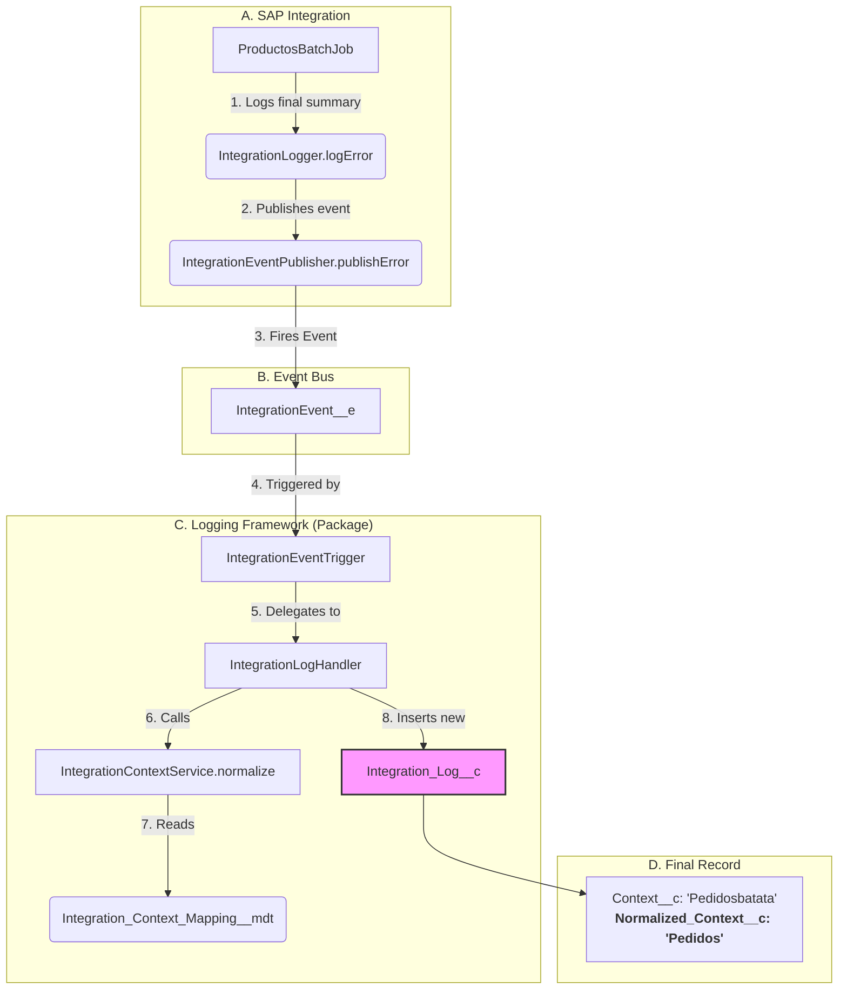

# Integration Framework Documentation (v2.0)

This document describes the two core frameworks that power our Salesforce integrations:

1.  **The SAP Integration Engine:** A reusable Apex framework for building scalable, high-speed, paginated batch jobs.
2.  **The Integration Logs Framework:** A self-contained, packageable framework for real-time, event-driven logging and monitoring (the `IntegrationLogsFramework` package).

## 1\. The Core Engine: `BasePaginatedBatchJob`

This framework replaces all previous `Queueable` and `Batchable` logic. It is a single, abstract class that manages the entire lifecycle of a paginated integration.

**Pattern:** "Fast & Safe State-Chaining Batch"

  * **Fast-Chaining:** The `finish()` method of one batch job immediately enqueues the *next* batch job using an inner `Queueable`, `PaginatedBatchStarter`. This is extremely fast, processing hundreds of pages in minutes, not hours.
  * **Safe:** A hard-coded `MAX_PAGES_FOR_CALL` limit in the `finish()` method acts as a safety stop to prevent run-away jobs in test environments.
  * **Stateful:** It passes a `BatchSummary` object from one job to the next, accumulating a single, consolidated set of metrics for the entire run.
  * **Self-Starting:** It provides a `public Queueable getStarter()` method, which is the only entry point needed to run the job.

### How to Use This Engine (e.g., Replicating `ProductosBatchJob`)

To create a new integration (e.g., `PedidosBatchJob`), you **must** create a class that `extends BasePaginatedBatchJob` and implement its 5 abstract methods.

Use `ProductosBatchJob.cls` as your template.

1.  **`getIntegrationLabel()`:** Return the string for logging (e.g., `"Pedidos Integration"`).
2.  **`getInitialResourcePath()`:** Return the OData query for the *first page*, including your `$expand` and `$filter` with `this.lastSyncDateStr`.
3.  **`processPageData()`:** Call your new `PedidosController.processOrderList()` method. This is where you do all your DML.
4.  **`updateSummaryFromResult()`:** Map the metrics from your controller's `ProcessResult` into the stateful `this.summary` object (e.g., `this.summary.totalRecordsUpserted += pageResult.ordersUpserted`).
5.  **`createNextInstance()`:** Return a new instance of your job, passing in all the stateful variables (like `this.nextLinkForFinish` and `this.summary`).

### How to Run an Integration

You **no longer** use a separate `IntegrationJob` class. You just create an instance of your batch job and call `getStarter()`.

```apex
// 1. Set the filter (e.g., yesterday)
String syncDate = Date.today().addDays(-1).format('yyyy-MM-dd');

// 2. Create the *initial* batch job instance
// (This example is for Productos)
BasePaginatedBatchJob job = new ProductosBatchJob(
    'https://sap.example.com/b1s/v1', // baseURL
    'PROFAR',                        // companyDB
    null,                            // username (uses Label)
    Label.PASS_PROFAR,               // password
    syncDate,                        // lastSyncDateStr (our filter)
    null,                            // nextLink (null for page 1)
    null,                            // summary (null to start)
    null                             // mockPayload (null for live)
);

// 3. Get its self-starter and enqueue it
System.enqueueJob(job.getStarter());
```

-----

## 2\. The Logging Framework: `IntegrationLogsFramework`

This is the packaged framework responsible for all logging and monitoring.

**Pattern:** "Normalize-on-Write"

This ensures that all data (reports, summaries, lists) is clean, while still preserving the original debug data.

### Data Flow (Write)

This is the new end-to-end flow for how a log is created:



### How to Configure (Admin Task)

The framework's normalization is controlled entirely by Custom Metadata.

  * **To add a new grouping:**
    1.  Go to **Setup** \> **Custom Metadata Types**.
    2.  Click **Manage Records** for "Integration Context Mappings".
    3.  Click **New**.
    4.  **Label:** `MiNuevaIntegracion`
    5.  **Context Keyword:** `minueva` (must be lowercase)
    6.  **Normalized Context:** `Mi Nueva Integracion`
  * **Result:** Any event published with a context like `"MiNuevaIntegracion_Job"` or `"minuevabatata"` will now be automatically normalized to `"Mi Nueva Integracion"`.

### How to Use (Developer Task)

Developers in *any* part of the org (not just SAP jobs) can now publish standardized logs using one line:

```apex
// For errors
IntegrationEventPublisher.publishError('Pedidos_Job_1', 'An error occurred', ...);

// For successes
IntegrationEventPublisher.publishInfo('Pedidos_Job_1', 'Batch completed', ...);
```

### Framework Components

  * **Core Logic:**
      * `IntegrationEvent__e`: The single Platform Event for all logs.
      * `Integration_Log__c`: The object that stores all logs.
      * `Normalized_Context__c`: The *new field* on `Integration_Log__c` used for clean reporting.
  * **Normalization (Trigger Flow):**
      * `IntegrationEventTrigger.trigger`: One-line trigger that delegates to the handler.
      * `IntegrationLogHandler.cls`: Creates the `Integration_Log__c` record.
      * `IntegrationContextService.cls`: The service that reads the CMDT and normalizes the context string.
      * `Integration_Context_Mapping__mdt`: The CMDT that stores the mapping rules (e.g., "pedidos" → "Pedidos").
  * **UI (LWC):**
      * `IntegrationHealthController.cls`: The Apex API for the LWC. It now groups by `Normalized_Context__c` to show clean summaries.
      * `integrationHealthDashboard.js`: The dashboard LWC.
  * **Analytics:**
      * `Integration_Executions_by_Context.report-meta.xml`: The new report, which groups by `Normalized_Context__c` for a clean chart.
  * **Permissions:**
      * `Integration_Dashboard_Read.permissionset-meta.xml`: The pre-built permission set required to view the dashboard and its components.