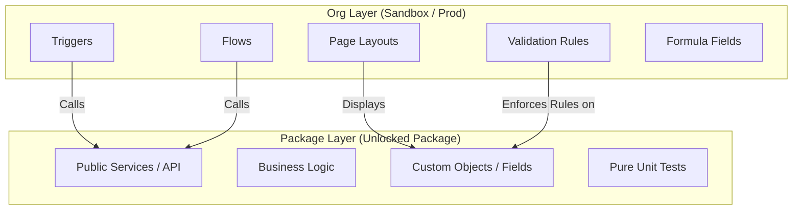

# 🏗 02. Architecture: Separating Logic from Org

## Package vs. Org Layer - Clean Architecture

In PDD, we split the application into two distinct layers:

1.  **Package Layer**: Pure business logic, standard object independence.
2.  **Org Layer**: Integrations, Triggers, Validation Rules, Page Layouts.

## Anatomy of a Package

A well-structured package (like `Descuentos Condicionados`) contains:

- **Domain-Specific Logic**: `DiscountCalculationService`, `DiscountRuleSyncService`.
- **Custom Metadata**: `Discount_Rule__c` (and its fields).
- **Package-Specific Fields**: fields that _only_ make sense within the context of this package.
- **Mock Providers**: Classes that allow tests to run without external dependencies to the Org.

## What STAYS OUT of the Package?

To keep packages portable and testable, avoid including:

- **Triggers**: Triggers bind logic to standard objects found in the _Org_. Keep triggers in `force-app/main` (the Org layer) and have them call the Package API.
- **Page Layouts**: Layouts are often customized by Admins. Avoid overwriting them.
- **Standard Object Customizations**: If you add a validation rule to `Account`, it might conflict with another package or existing org customization.
- **Profiles/Permission Sets**: While you _can_ package permission sets, be careful not to include org-wide permissions.

## Dependency Rules

> **Rule:** The Package Layer must NEVER depend on the Org Layer.

- **Correct Dependency**: `Org Level Trigger` calls `Package Service`.
- **Incorrect Dependency**: `Package Service` queries a field that exists _only_ in the Production Org but not in the package.

## Handling "Org" Constraints

If your package needs to interact with the Org (e.g., standard Order object), use the **Service Locator (Resolver)** pattern to load the implementation at runtime.

See [04. Implementation Patterns](./04_Implementation_Patterns.md) for code examples.
