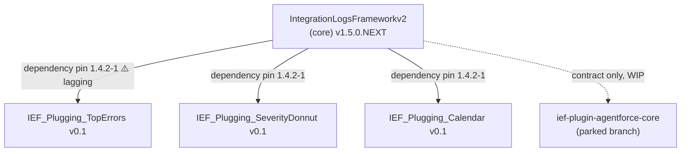
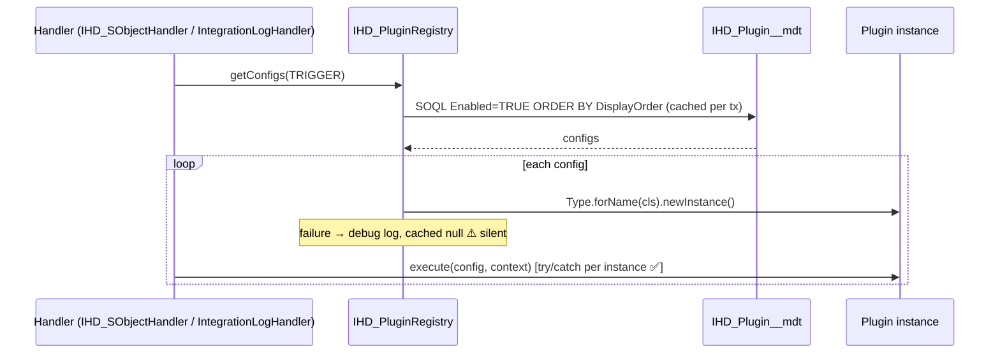
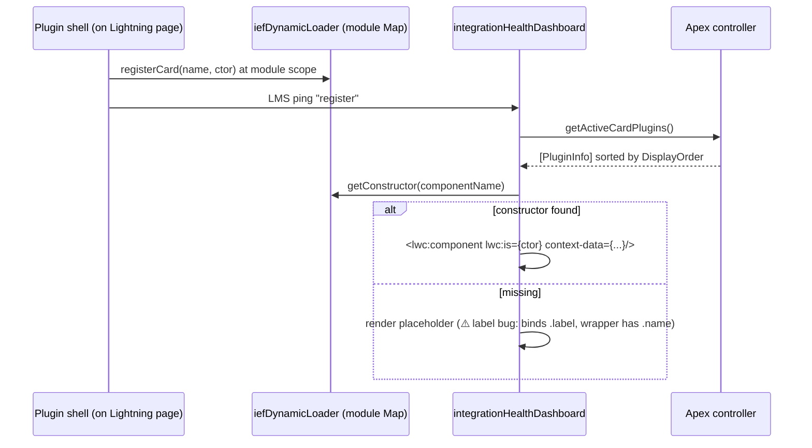

# Part 3 — IEF Today: The Honest Map

> Our implementation scored against the Part 1 concepts. Strong points first —
> they are real and worth protecting. Then debt, with file:line so you can verify
> every claim yourself.

## Package graph

## Runtime flows

**Apex plugin discovery (healthy seam):**

**LWC card composition (works, but eager):**

## Strong points (protect these)

1. **Real inversion of control in Apex** — interfaces + metadata + `Type.forName`,
   with per-instance try/catch isolation in trigger and service paths.
2. **`CallableIHD` reflection entry point** — downstream packages never compile-time
   depend on core internals. Exactly the go-plugin SDK instinct.
3. **Module-scope constructor registry** (`iefDynamicLoader`) — avoids Locker
   globals; deterministic; tested.
4. **Admin-managed runtime**: enable/disable via CMDT toggle with permission gate
   (`IHD_Manage_Plugins`), async metadata deploy, cache invalidation callback.
5. **Clean read-path layering**: controller → service → selector; ~all core classes
   tested.
6. **Robust emission pipeline**: DML-limit guards, schema truncation, kill-switch,
   errors funnel back as FRAMEWORK_INTERNAL events.

## Debt register (verify each against code)

### Structural

- **C1 — Core hosts plugin business logic.** Severity/TopErrors/Trend data methods
  live in `IntegrationHealthController/Service/Selector` even though those plugins
  ship no Apex. For a minimal standalone core these belong behind the plugin
  contract. _This is the headline item for the next iteration._
- **C2 — Dead Apex card seam.** All cards use `ApexClassName__c='N/A'`;
  `IHD_CardPlugin.getData` has zero real providers (three-role rule violated).
- **C6 — Plugins couple to core _schema_, not contracts.** Every plugin hardcodes
  `Integration_Log__c`, `OccurredAt__c`, etc. Schema renames break plugins at
  runtime, not compile time.
- **C7 — Triplicated boilerplate.** `_parseContextData` copy-pasted across all
  three card impls; severity mapping duplicated in calendar; date parsing next.

### Contract hygiene

- **No contract versioning** anywhere (pins lag silently).
- **C3 — Filters silently dropped:** cards send `filters`, Apex signatures ignore them.
- **C4 — Unrouted action:** severity card publishes `observationType`; dashboard's
  switch doesn't handle it. Drill-down loses its filter silently.
- **Speculative surface:** `IHD_ServicePlugin`, `IHD_FieldPlugin` have zero
  production implementations (esbuild two-hook discipline violated).

### Correctness / polish

- **C5 — Dead code in core:** `ihdTrendIndicator` orphaned; dashboard still fetches
  severity/top-errors it never renders (wasted round-trips every refresh);
  phantom `message.gridSpan` read; placeholder label bug; stray `console.log`.
- **C8 — Framework config shipped inside a UI plugin** (7 evaluation-rule CMDT rows
  in the calendar package). Uninstalling the calendar removes pipeline rules.
- **C9 — Two layout conventions** inside one package dir (`lwc/` vs
  `main/default/lwc/`).
- **C10 — Test gaps:** 7 of ~19 core LWC components tested; no test proves a
  _second-package_ plugin resolves via `Type.forName` in packaging context.
- **C11 — Misc:** wrong exception type on publish failure; hardcoded plugin-type
  strings scattered.

### Documented intent vs reality

The architecture doc states "core doesn't know about specific cards" — import
direction is clean, **but the same doc codifies `getSeverityCounts` /
`getTopErrorIntegrations` as core endpoints**, and describes Apex plugin classes
(`IHD_TopErrorsPlugin`) that were never built. The doc is honest about an
aspiration the code hasn't met yet. That gap is precisely the next iteration's scope.

## Self-test

1. Which debt items are _architectural_ (shape decisions) vs _hygiene_ (cleanup)?
   Classify C1–C11 before opening Part 04 — compare with its classification.
2. If we deleted the three plugin packages tomorrow, what would a user of just the
   core lose? What does that tell you about what the core actually is today?
