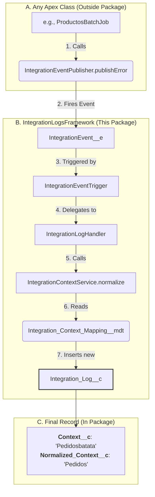

# `IntegrationLogsFramework` Package (v0.1.0-5)

This document describes the `IntegrationLogsFramework`, a self-contained, packageable solution for real-time, event-driven logging and monitoring in Salesforce.

## 1. Purpose

The framework provides a reusable, org-agnostic system for:

  * **Capturing** integration events (both errors and successes) from any Apex class.
  * **Normalizing** context names (e.g., "Pedidos\_Batch" → "Pedidos") for clean reporting.
  * **Persisting** events into a queryable `Integration_Log__c` object.
  * **Visualizing** integration health in real-time via a pre-built LWC dashboard and report.

## 2. Architecture: "Normalize-on-Write"

This pattern ensures that all data (reports, summaries, lists) is clean, while still preserving the original debug data.

### Data Flow



## 3. How to Use (For Developers)

To publish a log from *any* Apex class in your org, simply call the global `IntegrationEventPublisher` method.

```apex
// For errors:
IntegrationEventPublisher.publishError(
    'Pedidos_Job_1',           // Context (will be normalized)
    'An error occurred',       // Message
    ex.getStackTraceString(),  // Stack Trace
    'a01xx00000ABC',           // Payload ID
    '707xx00000ABC'            // Job ID
);

// For successes or info:
IntegrationEventPublisher.publishInfo(
    'Pedidos_Job_1',           // Context (will be normalized)
    'Batch completed',         // Message
    'a01xx00000ABC',           // Payload ID
    '707xx00000ABC'            // Job ID
);
```

## 4. How to Configure (For Admins)

The framework's normalization is controlled entirely by Custom Metadata.

  * **To add a new grouping:**
    1.  Go to **Setup** \> **Custom Metadata Types**.
    2.  Click **Manage Records** for "Integration Context Mappings".
    3.  Click **New**.
    4.  **Label:** `MiNuevaIntegracion`
    5.  **Context Keyword:** `minueva` (must be lowercase)
    6.  **Normalized Context:** `Mi Nueva Integracion`
  * **Result:** Any event published with a context like `"MiNuevaIntegracion_Job"` or `"minuevabatata"` will now be automatically normalized to `"Mi Nueva Integracion"`.

## 5. Core Package Components

This package installs the following components into the org:

### Data Model

  * **`IntegrationEvent__e`**: The single Platform Event that listens for all logs.
  * **`Integration_Log__c`**: The custom object that stores all persistent logs.
  * **`Integration_Context_Mapping__mdt`**: The Custom Metadata Type that stores the normalization rules.
  * **`Normalized_Context__c`**: The field on `Integration_Log__c` used for clean reporting.

### Logic (Apex)

  * **`IntegrationEventPublisher.cls`**: The global class developers use to publish events.
  * **`IntegrationEventTrigger.trigger`**: The one-line trigger on `IntegrationEvent__e`.
  * **`IntegrationLogHandler.cls`**: The trigger handler that creates the log record.
  * **`IntegrationContextService.cls`**: The service that reads the CMDT and normalizes the context string.
  * **`IntegrationHealthController.cls`**: The Apex API for the LWC dashboard.
  * **`IntegrationLogger.cls`**: The helper class that builds the final log message.

### UI (LWC & Analytics)

  * **`integrationHealthDashboard`**: The main LWC dashboard component.
  * **(Child LWCs)**: `ihdStatsCard`, `ihdTable`, `ihdFilters`, etc..
  * **`IntegrationFrameworkReports`**: The public report folder.
  * **`Integration_Executions_by_Context`**: The pre-built report and chart that groups by `Normalized_Context__c`.

## 6. Permissions

This package includes one permission set to grant access to the UI:

  * **`Integration_Dashboard_Read`**: Provides all necessary read access to the `Integration_Log__c` object, its fields, the `IntegrationHealthController` Apex class, and the LWC/Tab needed to view the dashboard. This must be assigned to any user who needs to see the dashboard.