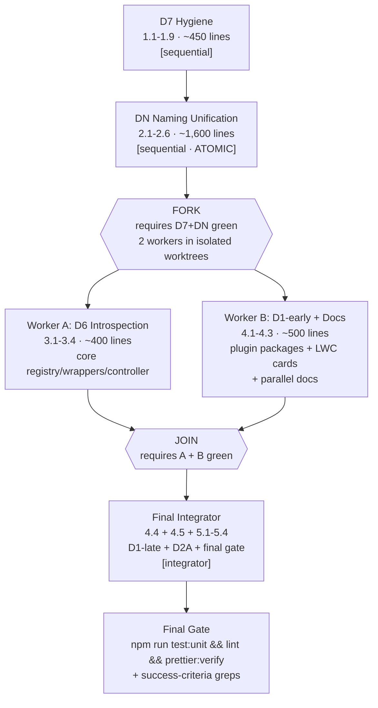

# Tasks: Minimal Core Hardening

## Review Workload Forecast

| Field                                  | Value                                                                                                          |
| -------------------------------------- | -------------------------------------------------------------------------------------------------------------- |
| Estimated changed lines                | ~3,400 total (D7 ~450, DN ~1,600, D6 ~400, D1 ~900, D2A ~250)                                                  |
| Line budget risk (session budget: 800) | High                                                                                                           |
| Chained PRs recommended                | Yes (sequential) / replaced by parallel worktrees (see Parallel Execution Plan)                                |
| Suggested split                        | PR 1 D7 → PR 2 DN → PR 3 D6 → PR 4 D1 → PR 5 D2A (legacy sequential) → Fork/Join worktrees below               |
| Delivery strategy                      | auto-forecast                                                                                                  |
| Chain strategy                         | pending — recommend feature-branch-chain (branching policy feature→dev→main; slices land on feature/core-next) |

Decision needed before apply: Yes
Chained PRs recommended: Yes (legacy) / superseded by parallel worktree plan
Chain strategy: pending
400-line budget risk: High

### Suggested Work Units (legacy sequential view — retained for reference)

| Unit             | Goal                            | Likely PR | Focused test command                                                               | Runtime harness                         | Rollback boundary                                  |
| ---------------- | ------------------------------- | --------- | ---------------------------------------------------------------------------------- | --------------------------------------- | -------------------------------------------------- |
| D7 hygiene       | Dead code, C3/C7/C8/C9/C11      | PR 1      | `npx sfdx-lwc-jest force-app/integration-logs-framework/lwc`                       | N/A — no org authed; jest + static only | Deletions/moves revert cleanly; no contract change |
| DN rename        | IEF namespace sweep             | PR 2      | `npm run test:unit`                                                                | N/A — org/2GP deferred                  | Pure source renames; `git revert` slice            |
| D6 introspection | Resolution + getCompositionInfo | PR 3      | `npm run lint` + static shape grep                                                 | N/A — Apex org-deferred                 | Additive members; revert slice                     |
| D1 extraction    | Card providers + reference card | PR 4      | `npx sfdx-lwc-jest force-app/integration-logs-framework/lwc/iefRegistryHealthCard` | N/A — org-deferred                      | Plugin pkg + core reference card; revert slice     |
| D2A versioning   | Contract_Version\_\_c guard     | PR 5      | `npm run test:unit`                                                                | N/A — org-deferred                      | Field default 1.0 = no-op until 2.0 declared       |

## Parallel Execution Plan

> Owner constraint: maximize parallelism via isolated git worktrees without introducing merge conflicts. Hygiene (D7) stays a small sequential prelude (~450 lines) before the DN bottleneck. DN is a global rename sweep (79 files, ~1,600 lines) — greenfield-only, no migration class — and MUST remain a single atomic slice (non-parallelizable internally). After DN, D6 (registry introspection) and D1-early (plugin providers 4.1–4.3) touch DISJOINT file sets and CAN run in parallel worktrees. Reference health card (4.5) dogfoods D6's `getCompositionInfo`, D2A builds on D6's `resolve()` version check, and core deletions (4.4) must happen after plugin providers exist — all three belong to the final integrator slice.

### Topology (fork/join)



### Execution Groups

| Group              | Worktree     | Tasks                                                            | Lines       | Depends on               | Produces                                                                                                                                |
| ------------------ | ------------ | ---------------------------------------------------------------- | ----------- | ------------------------ | --------------------------------------------------------------------------------------------------------------------------------------- |
| Sequential Prelude | `sequential` | D7 (1.1–1.9) + DN (2.1–2.6)                                      | ~2,050      | `feature/core-next` HEAD | Clean IEF-named baseline; all later work written once against final names                                                               |
| Worker A           | `A`          | D6 (3.1–3.4)                                                     | ~400        | D7+DN                    | `Resolution`/`resolve()` + `getCompositionInfo` + permission set; composition surface for health card & versioning                      |
| Worker B           | `B`          | D1-early (4.1–4.3) + parallel docs (5.3 draft + 1.9 filter docs) | ~500 + docs | D7+DN                    | Two real `IEF_CardPlugin` providers + LWC import swap; docs ready for integrator                                                        |
| Integrator         | `integrator` | D1-late (4.4, 4.5) + D2A (5.1–5.4) + final gate                  | ~650 + gate | A + B (join)             | Core deletions, reference health card (dogfoods D6), version guard (extends D6 `resolve()`), contract doc finalization, full validation |

### Worktree File Ownership (disjoint during parallel window)

> Proof of no overlap while A and B run concurrently. After JOIN, the integrator owns the merge and the files both workers intentionally deferred.

| Worktree                 | Owned file sets (exact)                                                                                                                                                                                                                                                                                                                                                                                                                                                                                                                                                                                                                                                                                                                                                                                                                                                                                                                                                                                                                                                                                                                                                                                                                                                                                                                                                                                                                                                                                                                                                                                                                                                                                          | Must NOT touch                                                                                                                                                                                                                                                          |
| ------------------------ | ---------------------------------------------------------------------------------------------------------------------------------------------------------------------------------------------------------------------------------------------------------------------------------------------------------------------------------------------------------------------------------------------------------------------------------------------------------------------------------------------------------------------------------------------------------------------------------------------------------------------------------------------------------------------------------------------------------------------------------------------------------------------------------------------------------------------------------------------------------------------------------------------------------------------------------------------------------------------------------------------------------------------------------------------------------------------------------------------------------------------------------------------------------------------------------------------------------------------------------------------------------------------------------------------------------------------------------------------------------------------------------------------------------------------------------------------------------------------------------------------------------------------------------------------------------------------------------------------------------------------------------------------------------------------------------------------------------------- | ----------------------------------------------------------------------------------------------------------------------------------------------------------------------------------------------------------------------------------------------------------------------- |
| **sequential** (D7 + DN) | `force-app/integration-logs-framework/lwc/ihdTrendIndicator/` (delete), `force-app/integration-logs-framework/lwc/integrationHealthDashboard/*` (will become `iefDashboard` after DN), `force-app/integration-logs-framework/lwc/ihdAdminPanel/`, `force-app/integration-logs-framework/classes/IntegrationHealthWrappers.cls` (label field only for 1.4), `force-app/integration-logs-framework/classes/IntegrationEventPublisher.cls`, `force-app/integration-logs-framework/classes/IHD_PluginType.cls` (new, becomes `IEF_PluginType`), `force-app/integration-logs-framework/classes/IHD_PublishException.cls` (new), `force-app/integration-logs-framework/lwc/iefPluginContext/` (new shared parse module), `force-app/ihd-plugin-calendar/main/default/customMetadata/idhIntegration_Evaluation_Rule.*` (move source), `force-app/integration-logs-framework/customMetadata/` (move destination), `force-app/integration-logs-framework/main/default/lwc/{iefCardPlaceholder,iefDynamicLoader,iefPluginCard}` (move to `lwc/`), all `IHD_*`→`IEF_*` renames: `force-app/integration-logs-framework/classes/*`, `force-app/integration-logs-framework/objects/IHD_Plugin__mdt/`→`IEF_Plugin__mdt/`, `force-app/integration-logs-framework/customPermissions/IHD_Manage_Plugins`→`IEF_Manage_Plugins`, `force-app/integration-logs-framework/labels/`, `force-app/integration-logs-framework/translations/`, `force-app/integration-logs-framework/permissionsets/`, `force-app/ihd-plugin-*/`→`force-app/ief-plugin-*/`, `sfdx-project.json`, `config/package-map.json`, LWC bundles `ihd*`→`ief*` + `integrationHealthDashboard`→`iefDashboard` + `lastUpdatedFooter/progressBar/timeClockPicker`→`ief*` | — (runs alone)                                                                                                                                                                                                                                                          |
| **A** (D6)               | `force-app/integration-logs-framework/classes/IEF_PluginRegistry.cls` (add `Resolution` + `resolve()` — orphan/version scaffolding without D2A guard), `force-app/integration-logs-framework/classes/IntegrationHealthWrappers.cls` (add `PluginCompositionEntry`), `force-app/integration-logs-framework/classes/IntegrationHealthController.cls` (add `getCompositionInfo()` — deletions deferred to integrator), `force-app/integration-logs-framework/classes/CallableIEF.cls` (add `getCompositionInfo` action), `force-app/integration-logs-framework/classes/IEF_SObjectHandler.cls` (migrate `getInstance`→`resolve()`), `force-app/integration-logs-framework/classes/IEF_PluginRegistryTest.cls` + new idempotent-registration CI test class (task 3.3), `force-app/integration-logs-framework/permissionsets/Integ_PluginIntrospection_Read.permissionset-meta.xml` (new), `Permissions.md` (update)                                                                                                                                                                                                                                                                                                                                                                                                                                                                                                                                                                                                                                                                                                                                                                                                  | `force-app/ief-plugin-severity/**`, `force-app/ief-plugin-toperrors/**`, `docs/plugin-contract-versioning.md`, reference health card files (4.5), `IEF_PluginContract` / `Contract_Version__c` (D2A)                                                                    |
| **B** (D1-early + docs)  | `force-app/ief-plugin-severity/main/default/classes/IEF_SeverityCardPlugin.cls` (new — selector logic moved from core), `force-app/ief-plugin-severity/main/default/customMetadata/IEF_Plugin.Severity_Card.md-meta.xml` (`ApexClassName__c` `N/A`→`IEF_SeverityCardPlugin`), `force-app/ief-plugin-severity/main/default/lwc/iefSeverityCardImpl/*` + `iefSeverityBreakdown/*` + `iefSeverityShell/*` (import `c/iefPluginContext` + swap Apex import to own-package `getCardData`), `force-app/ief-plugin-toperrors/main/default/classes/IEF_TopErrorsCardPlugin.cls` (new — trend logic folds into `entry.trend`), `force-app/ief-plugin-toperrors/main/default/customMetadata/IEF_Plugin.TopErrors_Card.md-meta.xml`, `force-app/ief-plugin-toperrors/main/default/lwc/iefTopErrorsCardImpl/*` + `iefTopErrorIntegrations/*` + `iefTopErrorsShell/*`, `docs/plugin-contract-versioning.md` (parallel draft — additive-only evolution, minor/major semantics; integrator finalizes) + ApexDocs on new providers for C3 filter support (task 1.9 completion)                                                                                                                                                                                                                                                                                                                                                                                                                                                                                                                                                                                                                                                   | `force-app/integration-logs-framework/classes/IEF_PluginRegistry.cls`, `IntegrationHealthWrappers.cls`, `IntegrationHealthController.cls`, `CallableIEF.cls`, `IEF_SObjectHandler.cls`, `Permissions.md` introspection set, reference health card, `IEF_PluginContract` |
| **integrator** (join)    | `force-app/integration-logs-framework/classes/IntegrationHealthController.cls` (delete `getSeverityCounts`/`getTopErrorIntegrations`/`getHourlyTrend`), `force-app/integration-logs-framework/classes/IntegrationHealthService.cls` (delete aggregates), `force-app/integration-logs-framework/classes/IntegrationHealthSelector.cls` (delete `getLogCountsByIntegrationCode` etc.), `force-app/integration-logs-framework/classes/IEF_RegistryHealthCardPlugin.cls` (new) + `force-app/integration-logs-framework/lwc/iefRegistryHealthCard/` + `force-app/integration-logs-framework/lwc/iefRegistryHealthShell/` + `force-app/integration-logs-framework/customMetadata/IEF_Plugin.Plugin_Registry_Health.md-meta.xml`, `force-app/integration-logs-framework/objects/IEF_Plugin__mdt/fields/Contract_Version__c.field-meta.xml` (new) + `force-app/integration-logs-framework/classes/IEF_PluginContract.cls` (`SUPPORTED_MAJOR=1`), `force-app/integration-logs-framework/classes/IEF_PluginRegistry.cls` (add D2A major-mismatch check inside `resolve()` — builds on A's scaffolding → `SKIPPED_VERSION_MISMATCH` + FRAMEWORK_INTERNAL event), `docs/plugin-contract-versioning.md` (finalize/verify), full validation                                                                                                                                                                                                                                                                                                                                                                                                                                                                                    | — (runs after A+B merged; owns remaining core deletions)                                                                                                                                                                                                                |

> **Disjointness guarantee during parallel window:** Worker A touches only `force-app/integration-logs-framework/classes/` + `permissionsets/` + `Permissions.md`; Worker B touches only `force-app/ief-plugin-*` + `docs/plugin-contract-versioning.md`. Zero file overlap → `git merge` of A then B is conflict-free by construction. The one intentional same-file evolution is `IEF_PluginRegistry.cls`: Worker A creates `Resolution`/`resolve()` without the version guard; the integrator adds the D2A guard inside that same `resolve()` after A has landed — sequenced, not parallel.

### Worktree Isolation & Merge Strategy

**Worktree creation (run from repo root on `feature/core-next`):**

```bash
# 0. Ensure baseline is pushed and clean
git fetch origin
git checkout feature/core-next
git pull --ff-only
git status --porcelain  # must be clean

# 1. Sequential prelude — run directly on feature/core-next (no worktree needed)
#    D7 (1.1-1.9) then DN (2.1-2.6) land as two commits/slices, pushed before forking.
#    Gate before fork:
npm run test:unit && npm run lint && npm run prettier:verify
grep -ri "ihd" force-app sfdx-project.json config translations || echo "DN sweep OK"
#    push: git push origin feature/core-next

# 2. Create isolated worktrees for the parallel window (fork from updated feature/core-next)
git worktree add ../wt-a-d6 -b wip/minimal-core-d6 feature/core-next
git worktree add ../wt-b-d1early -b wip/minimal-core-d1early feature/core-next
# Optional doc check: git worktree list

# 3. Workers run concurrently (see parallel-plan.md for exact prompt slices):
#    Worker A in ../wt-a-d6 → tasks 3.1-3.4
#    Worker B in ../wt-b-d1early → tasks 4.1-4.3 + 5.3 draft + C3 docs
#    Each worker commits locally; no push to feature/core-next until integrator merges.

# 4. Join on feature/core-next (merge order: A then B — A is the dependency for integrator)
git checkout feature/core-next
git merge --no-ff wip/minimal-core-d6 -m "merge: D6 composition introspection (Worker A)"
git merge --no-ff wip/minimal-core-d1early -m "merge: D1-early plugin providers + parallel docs (Worker B)"
git push origin feature/core-next  # optional checkpoint; integrator can also push at the end

# 5. Integrator worktree (or directly on feature/core-next after join)
git worktree add ../wt-integrator -b wip/minimal-core-integrator feature/core-next
# Integrator in ../wt-integrator → tasks 4.4, 4.5, 5.1, 5.2, 5.4 (+ finalize 5.3)

# 6. Cleanup after integrator merges and pushes
git worktree remove ../wt-a-d6
git worktree remove ../wt-b-d1early
git worktree remove ../wt-integrator
git branch -d wip/minimal-core-d6 wip/minimal-core-d1early wip/minimal-core-integrator
```

**Merge order rationale:** Worker A first, then Worker B. Worker A's `IEF_PluginRegistry.resolve()` is the base that the integrator's D2A version guard extends (task 5.2 inserts the major-mismatch check inside `resolve()`). Merging A first gives the integrator a single, correct `resolve()` to patch. Worker B's plugin packages are independent of that file, so order between A and B is otherwise interchangeable — but A-then-B keeps the dependency direction explicit.

**Conflict expectations:**

| Scenario                                                      | Expected result                                                                                                                                                                                                                                                                                                                  |
| ------------------------------------------------------------- | -------------------------------------------------------------------------------------------------------------------------------------------------------------------------------------------------------------------------------------------------------------------------------------------------------------------------------- |
| `git merge wip/minimal-core-d6` into `feature/core-next`      | Clean (A diverged only in core registry files that `feature/core-next` hasn't touched since DN)                                                                                                                                                                                                                                  |
| `git merge wip/minimal-core-d1early` after A                  | Clean (B touched only `ief-plugin-*` + `docs/`; A touched only core classes + permission set — disjoint sets, no overlapping hunks)                                                                                                                                                                                              |
| Integrator editing `IEF_PluginRegistry.cls` after both merges | No merge conflict (integrator is not merging a branch — it edits the already-merged `resolve()` in place to add the version check)                                                                                                                                                                                               |
| **One expected non-conflict but same-file sequential edit**   | `IntegrationHealthController.cls`: Worker A adds `getCompositionInfo()`; integrator later deletes `getSeverityCounts`/`getTopErrorIntegrations`/`getHourlyTrend` from the same file. Because the integrator runs _after_ A's merge, this is a normal sequential edit, not a parallel merge conflict. No concurrent modification. |

If any merge reports a conflict, it signals a **file-set violation** (a worker touched a file outside its ownership table). Abort the merge, inspect `git diff --name-only` against the ownership table, and move the stray change to the correct worktree/integrator.

**Integrator validation (must be green before push):**

```bash
# Inside integrator worktree (or on feature/core-next after integrator commits)
npm run test:unit
npm run lint
npm run prettier:verify

# Proposal success-criteria greps (from proposal.md + spec.md)
# 1. Zero plugin-specific aggregates remain in core
! grep -rn "getSeverityCounts\|getTopErrorIntegrations\|getHourlyTrend\|getLogCountsByIntegrationCode" force-app/integration-logs-framework/classes

# 2. Zero ihd/IHD references outside allowlist
! grep -ri "ihd" force-app sfdx-project.json config --exclude-dir=archive 2>/dev/null | grep -v "docs/archive" | grep -v "docs/architecture-study"
! grep -r "Plugging" sfdx-project.json config

# 3. No silent-null caching / no debug log in resolve path
! grep -rn "System\.debug" force-app/integration-logs-framework/classes/IEF_PluginRegistry.cls

# 4. Three-role rule: reference health card exists and is registered
test -f force-app/integration-logs-framework/classes/IEF_RegistryHealthCardPlugin.cls
test -f force-app/integration-logs-framework/lwc/iefRegistryHealthCard/iefRegistryHealthCard.js
grep -q "Plugin_Registry_Health" force-app/integration-logs-framework/customMetadata/*.md-meta.xml 2>/dev/null || grep -rq "Plugin_Registry_Health" force-app/

# 5. Contract version guard + doc
test -f force-app/integration-logs-framework/objects/IEF_Plugin__mdt/fields/Contract_Version__c.field-meta.xml
grep -q "SUPPORTED_MAJOR" force-app/integration-logs-framework/classes/IEF_PluginContract.cls
test -f docs/plugin-contract-versioning.md && grep -q "additive" docs/plugin-contract-versioning.md

# 6. Dead code & hygiene
! grep -rn "ihdTrendIndicator\|message\.gridSpan\|console\.log" force-app/integration-logs-framework/lwc force-app/integration-logs-framework/classes 2>/dev/null
test $(find force-app/integration-logs-framework/main/default -name "*.js-meta.xml" -path "*lwc*" 2>/dev/null | wc -l) -eq 0
test $(find force-app/ihd-plugin-calendar 2>/dev/null | wc -l) -eq 0  # renamed to ief-plugin-calendar after DN
grep -q "parseContextData" force-app/integration-logs-framework/lwc/iefPluginContext/iefPluginContext.js
```

All checks must pass; Apex org-deferred verifications remain flagged for CI/org (see Testing Strategy in design.md) and do not block the local gate.

---

## Phase 1: D7 — Core Hygiene [Worktree: sequential — runs directly on `feature/core-next` before fork]

> Prelude: small (~450 lines), touches many core files but is intentionally sequential. Must land and pass `npm run test:unit` + static greps before DN. No parallelism here.

- [x] 1.1 [sequential] Delete `lwc/ihdTrendIndicator/` + its jest test; remove references from `integrationHealthDashboard`. Verify: grep `ihdTrendIndicator` ⇒ 0
- [x] 1.2 [sequential] RED jest: dashboard asserts no severity/topErrors Apex import (mock module, assert not called)
- [x] 1.3 [sequential] Remove phantom fetches, `severityCounts`/`topErrors` props, `message.gridSpan` read, `console.log` in `lwc/integrationHealthDashboard/*.js`; `console.log` in `ihdAdminPanel.js`. Verify: `grep -rn "getSeverityCounts\|getTopErrorIntegrations\|message.gridSpan\|console.log"` core lwc/classes ⇒ 0
- [x] 1.4 [sequential] RED jest: placeholder renders human-readable label for provider-less card; healthy card renders data. GREEN: add `PluginInfo.label` to `classes/IntegrationHealthWrappers.cls`; bind `plugin.label` + reason in dashboard HTML
- [x] 1.5 [sequential] Move `customMetadata/idhIntegration_Evaluation_Rule.{7 rows}.md-meta.xml` calendar pkg → core `customMetadata/`. Verify: 7 files in core, 0 in calendar
- [x] 1.6 [sequential] C9: move `main/default/lwc/{iefCardPlaceholder,iefDynamicLoader,iefPluginCard}` → `lwc/`. Verify: `find force-app/integration-logs-framework/main/default -name "*.js-meta.xml"` ⇒ 0
- [x] 1.7 [sequential] TDD: create `lwc/iefPluginContext/iefPluginContext.js` (`parseContextData(raw)` → `{context,error}`) + jest (malformed/empty/valid, no throw); update 3 plugin card impls to import it. Verify: `grep -rn "_parseContextData" force-app` ⇒ only `iefPluginContext.js`
- [x] 1.8 [sequential] C11: create `IHD_PluginType` enum (TRIGGER/SERVICE/FIELD/CARD); create `IHD_PublishException`, throw in `classes/IntegrationEventPublisher.cls`; replace string literals in registry/handler. Verify: no `'TRIGGER'|'SERVICE'|'CARD'|'FIELD'` literals outside enum/CMDT. Org-deferred: typed publish failure
- [x] 1.9 [sequential] Filter alignment (C3): ApexDocs on providers list unsupported filters. Verify: static doc check — _note: providers created in D1-early (Worker B) will complete this doc; this task establishes the doc convention and covers any pre-existing providers. Worker B finalizes C3 docs on the new `IEF_SeverityCardPlugin`/`IEF_TopErrorsCardPlugin`._

## Phase 2: DN — IEF Naming Unification [Worktree: sequential — ATOMIC, non-parallelizable]

> Bottleneck: global rename sweep (~1,600 lines, 79 files). Greenfield-only, no migration class. Cannot be parallelized internally — every `IHD_`/`ihd` reference must land in one compile-consistent slice. Must be green (`npm run test:unit` + zero-ihd sweep) before fork. After DN, every `IHD_`/`ihd` identifier in earlier task descriptions reads as its `IEF_`/`ief` equivalent per design.md canonical map.

- [ ] 2.1 [sequential · ATOMIC] Rename core Apex + tests/stubs per design naming map (`IHD_*`→`IEF_*`, `CallableIHD`(+Test)→`CallableIEF`, `TestStub_*`); one compile-consistent slice
- [ ] 2.2 [sequential · ATOMIC] Rename CMDT object `IHD_Plugin__mdt`→`IEF_Plugin__mdt` (fields unchanged) + record files; update CMDT `ApexClassName__c` values; no migration class (greenfield)
- [ ] 2.3 [sequential · ATOMIC] Rename LWC bundles per map (`ihd*`→`ief*`, `integrationHealthDashboard`→`iefDashboard`, generic `lastUpdatedFooter/progressBar/timeClockPicker`→`ief*`); update every `c-ihd-*`/`c/ihd*` ref in HTML/JS/jest/mocks. Verify: `npm run test:unit` green
- [ ] 2.4 [sequential · ATOMIC] Rename plugin dirs `force-app/ihd-plugin-*`→`ief-plugin-*`; fix `IEF_Plugging_*`→`IEF_Plugin_*` in `sfdx-project.json` + `config/package-map.json`. Verify: `grep -r Plugging` ⇒ 0
- [ ] 2.5 [sequential · ATOMIC] Rename `IHD_Manage_Plugins` custom permission, `IHD_Tab_*`/`IHD_System_Pulse` labels, `translations/es` + permissionset refs
- [ ] 2.6 [sequential · ATOMIC] Final sweep: `grep -ri ihd force-app sfdx-project.json config translations` ⇒ 0 outside `docs/archive/**`, `docs/architecture-study/**`; `npm run lint` + `prettier:verify` green. Org-deferred: 2GP rename via new package versions

## Phase 3: PARALLEL WINDOW — Fork (requires D7+DN green) [Worktrees: A ∥ B]

> Two background agents in isolated worktrees. File sets are disjoint — merges are conflict-free by construction. Both workers must be green before the integrator starts. See Worktree File Ownership table and Worktree Isolation & Merge Strategy above.

### Branch A: D6 — Composition Introspection [Worktree: A — `../wt-a-d6`]

> Touches: core registry/wrappers/controller/callable. Does NOT touch plugin packages or docs (except `Permissions.md`). Depends on DN (IEF names). Enables the integrator's health card (4.5) and version guard (5.2).

- [ ] 3.1 [Worktree: A] Add `Resolution{instance,status,reason}` + `resolve(IEF_Plugin__mdt)` to `classes/IEF_PluginRegistry.cls`; statuses ACTIVE/ACTIVE_LWC/FAILED/ORPHAN; orphan via `Type.forName == null`; migrate `getInstance` callers (`IEF_SObjectHandler`, `CallableIEF`, controller). Verify: no `System.debug`/silent null in resolve path
- [ ] 3.2 [Worktree: A] Add `PluginCompositionEntry` to `IntegrationHealthWrappers.cls`; `getCompositionInfo()` on `IntegrationHealthController` + additive `CallableIEF` action. Verify: static shape grep. Org-deferred: healthy/failing/orphan/recovery scenarios
- [ ] 3.3 [Worktree: A] Idempotent registration: ship org-deferred CI test class (duplicate DeveloperName ⇒ one row, no exception)
- [ ] 3.4 [Worktree: A] Create `Integ_PluginIntrospection_Read` permission set; update `Permissions.md`

### Branch B: D1-early — Plugin Providers + Parallel Docs [Worktree: B — `../wt-b-d1early`]

> Touches: plugin packages (`ief-plugin-severity`, `ief-plugin-toperrors`) and their LWC cards + parallel docs. Does NOT touch core registry/controller/wrappers. Depends on DN (IEF names). Must exist before integrator can delete core aggregates (4.4) and dogfood D6 (4.5).

- [ ] 4.1 [Worktree: B] Create `ief-plugin-severity/.../IEF_SeverityCardPlugin.cls` implementing `IEF_CardPlugin` (move selector logic; `@AuraEnabled getCardData(filters)`); CMDT row `ApexClassName__c 'N/A'`→plugin class
- [ ] 4.2 [Worktree: B] Create `ief-plugin-toperrors/.../IEF_TopErrorsCardPlugin.cls` (+ trend logic folds into `entry.trend`); CMDT row update
- [ ] 4.3 [Worktree: B] Swap card LWC Apex imports to own-package `getCardData(filters)`. Verify: `PluginContext` contextData JSON shape diff — no removed/renamed keys; existing card jest unchanged and green
- [ ] 5.3 [Worktree: B · parallel docs] Create `docs/plugin-contract-versioning.md`: additive-only evolution, minor/major bump semantics. Verify: static content check — _drafted in parallel so integrator has the guide; integrator finalizes/validates. This is the documentation parallelization owner requested._
- [ ] 1.9′ [Worktree: B · docs completion] Finalize C3 filter-alignment ApexDocs on the new providers (`IEF_SeverityCardPlugin`, `IEF_TopErrorsCardPlugin` — declare supported/unsupported filters). Verify: static doc check — _completes task 1.9 for providers that didn't exist during D7._

## Phase 4: INTEGRATOR — Join (requires Worker A + Worker B green) [Worktree: integrator — `../wt-integrator`]

> Runs after `git merge wip/minimal-core-d6` then `git merge wip/minimal-core-d1early` into `feature/core-next`. Merges should be conflict-free (see strategy). Integrator is the ONLY agent that edits `IEF_PluginRegistry.resolve()` with the version guard (extends A's scaffolding) and deletes core aggregates (depends on B's providers existing).

### D1-late — Core Deletions + Reference Health Card

- [ ] 4.4 [Worktree: integrator] Delete `getSeverityCounts/getTopErrorIntegrations/getHourlyTrend/getLogCountsByIntegrationCode` from Controller/Service/Selector. Verify: grep in core classes ⇒ 0 — _depends on 4.1–4.3 (providers exist); runs after B merged._
- [ ] 4.5 [Worktree: integrator] RED jest: `iefRegistryHealthCard` renders mocked composition entries (active + failed). GREEN: create `IEF_RegistryHealthCardPlugin.cls`, `lwc/iefRegistryHealthCard/`, `lwc/iefRegistryHealthShell/`, CMDT row `Plugin_Registry_Health` (CARD, `CardLocation__c='summary'`). Verify: three-role static check — _depends on D6 `getCompositionInfo` (Worker A merged); dogfoods D6._

### D2A — Contract Versioning (extends D6's `resolve()`)

- [ ] 5.1 [Worktree: integrator] Create `objects/IEF_Plugin__mdt/fields/Contract_Version__c.field-meta.xml` (default `1.0`) + `classes/IEF_PluginContract.cls` (`SUPPORTED_MAJOR = 1`)
- [ ] 5.2 [Worktree: integrator] RED jest: skipped plugin (mock `SKIPPED` status) ⇒ placeholder with reason, other cards render, no unhandled error. GREEN: major-mismatch check in `resolve()` ⇒ no instantiation, `PluginInfo.status='SKIPPED'` + reason, one FRAMEWORK*INTERNAL event per row per tx — \_depends on D6 `resolve()` scaffolding (Worker A merged); inserts version check inside that method.*
- [ ] 5.3′ [Worktree: integrator · docs finalize] Finalize and verify `docs/plugin-contract-versioning.md` (if drafted by Worker B, validate content; if not, create). Verify: doc contains additive-only + bump semantics — _ensures integrator validation has the guide._
- [ ] 5.4 [Worktree: integrator · final gate] Final gate: `npm run test:unit && npm run lint && npm run prettier:verify` + proposal success-criteria greps (see Worktree Isolation & Merge Strategy validation block). All Apex org-deferred checks remain flagged for CI/org.
